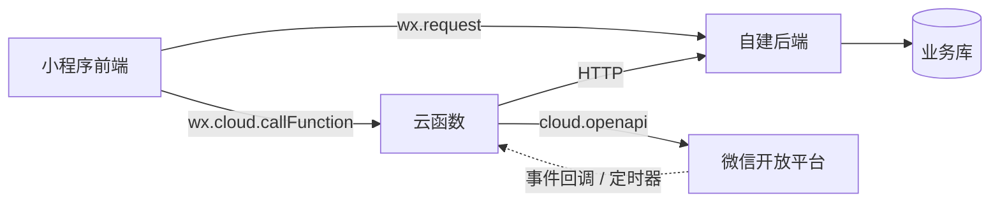

# 云函数

云函数原理、与自建后端的边界、使用限制见 [云函数](../../reference/cloud-function/)。

## 架构定位

混用方案下，云函数**只做微信侧适配**——调微信开放接口、接微信事件回调、跑云定时器。业务数据流仍走自建后端，业务库与用户体系不分裂。



边界口诀：**凡是「调微信接口」+「不需要碰业务库」的活给云函数；凡是「要碰业务库 / 要和用户体系联动」的活给自建后端。**

## services/cloud 封装

统一封装 `wx.cloud.callFunction`，屏蔽 Promise 化与错误处理，所有云函数调用收口于此：

```ts
// services/cloud/callFunction.ts
interface CloudCallOptions<T = unknown> {
  name: string;          // 云函数名
  data?: Record<string, unknown>;
}

export const callFunction = <T = unknown>(
  options: CloudCallOptions<T>,
): Promise<T> => {
  return new Promise((resolve, reject) => {
    wx.cloud.callFunction({
      name: options.name,
      data: options.data,
      success: (res) => resolve(res.result as T),
      fail: (err) => reject(err),
    });
  });
};
```

:::warning[初始化]
调用前必须在 `app.ts` 的 `onLaunch` 中执行 `wx.cloud.init({ env: 'your-env-id' })`，详见 [云函数 - 初始化](../../reference/cloud-function/#配置)。
:::

## 场景一：订阅消息推送

业务后端处理完订单后，通过 HTTP 触发云函数发订阅消息。云函数只负责调 `cloud.openapi.subscribeMessage.send`，**不碰订单库**。

### 1. 云函数（部署到微信云）

```js
// cloudfunctions/sendOrderNotify/index.js
const cloud = require('wx-server-sdk');
cloud.init({ env: cloud.DYNAMIC_CURRENT_ENV });

exports.main = async (event) => {
  const { openid, orderNo, amount } = event;

  // 直接调微信开放接口，免 access_token 管理
  await cloud.openapi.subscribeMessage.send({
    touser: openid,
    templateId: 'your-template-id',
    page: `pages/order/detail?orderNo=${orderNo}`,
    data: {
      thing1: { value: `订单 ${orderNo}` },
      amount2: { value: `¥${amount}` },
    },
    miniprogramState: 'formal',
  });

  return { success: true };
};
```

### 2. 自建后端触发

```java
// Java 示例：订单支付成功后回调云函数
public void notifyCloudFunction(String orderNo, String openid, BigDecimal amount) {
    Map<String, Object> payload = Map.of(
        "openid", openid,
        "orderNo", orderNo,
        "amount", amount
    );
    httpClient.post(
        "https://your-env-id.service.tcloudbase.com/sendOrderNotify",
        payload
    );
}
```

:::tip
云函数的事件源是**自建后端的 HTTP 调用**，不是小程序前端。这样保证只有后端能触发推送，前端无法伪造。
:::

## 场景二：生成推广小程序码

用户在小程序里点「分享海报」→ pages 层调 services → services 调云函数 → 云函数用 `cloud.openapi.wxacode.getUnlimited` 生成并直接存云存储，返回 CDN URL。

### 1. 云函数

```js
// cloudfunctions/genQrcode/index.js
const cloud = require('wx-server-sdk');
cloud.init({ env: cloud.DYNAMIC_CURRENT_ENV });

exports.main = async (event) => {
  const { scene, page = 'pages/index/index' } = event;

  // 生成小程序码
  const result = await cloud.openapi.wxacode.getUnlimited({
    scene,           // 如 "ref=user_123"，最长 32 字符
    page,
    checkPath: false,
    envVersion: 'release',
  });

  // 上传到云存储
  const { fileID } = await cloud.uploadFile({
    cloudPath: `qrcode/${Date.now()}.jpg`,
    fileContent: result.buffer,
  });

  return { fileID };
};
```

### 2. services 层封装

```ts
// services/cloud/qrcode.ts
import { callFunction } from './callFunction';

interface GenQrcodeParams {
  scene: string;          // 推广员 ID 等
  page?: string;
}

export const genQrcode = (params: GenQrcodeParams) => {
  return callFunction<{ fileID: string }>({
    name: 'genQrcode',
    data: params,
  });
};
```

### 3. pages 层调用

```ts
// pages/poster/poster.ts
import { genQrcode } from '@/services/cloud/qrcode';

Page({
  data: { qrcodeUrl: '', loading: false },

  async onGenTap() {
    this.setData({ loading: true });
    try {
      const { fileID } = await genQrcode({
        scene: `ref=${this.data.userId}`,
      });
      this.setData({ qrcodeUrl: fileID });
    } catch (err) {
      wx.showToast({ title: '生成失败', icon: 'error' });
    } finally {
      this.setData({ loading: false });
    }
  },
});
```

```xml
<!-- pages/poster/poster.wxml -->
<image src="{{qrcodeUrl}}" mode="aspectFit" />
<t-button bindtap="onGenTap" loading="{{loading}}">生成推广码</t-button>
```

## 场景三：客服消息自动回复

用户在小程序客服会话里发消息 → 微信把消息事件推送到云函数 → 云函数直接回消息。**自建后端完全不参与**。

### 1. 云函数（绑定消息推送）

```js
// cloudfunctions/customerService/index.js
const cloud = require('wx-server-sdk');
cloud.init({ env: cloud.DYNAMIC_CURRENT_ENV });

exports.main = async (event) => {
  // event 由微信推送，含 MsgType、Content、FromUserName 等
  const { MsgType, Content, FromUserName: openid } = event;

  if (MsgType !== 'text') {
    return { success: true };
  }

  // 关键词路由
  const replyMap = {
    人工: '正在为您转接人工客服，请稍候…',
    退款: '退款流程请前往「我的-订单」点击申请退款',
  };

  const replyText = replyMap[Content] || '收到您的消息，稍后回复';

  await cloud.openapi.customerServiceMessage.send({
    touser: openid,
    msgtype: 'text',
    text: { content: replyText },
  });

  return { success: true };
};
```

### 2. 配置

在小程序后台「开发管理 → 开发设置 → 消息推送」中绑定该云函数即可，无需自建后端配置回调 URL 与鉴权。

## 场景四：定时任务

云定时器每天 9:00 触发云函数，给次日到期的预约用户发订阅消息。**无需自建后端的调度服务**。

### 1. 云函数

```js
// cloudfunctions/dailyReminder/index.js
const cloud = require('wx-server-sdk');
cloud.init({ env: cloud.DYNAMIC_CURRENT_ENV });

exports.main = async () => {
  // 1. 向自建后端查询明日到期的预约列表
  const resp = await fetch('https://your-domain.com/api/reminders/tomorrow');
  const { list } = await resp.json();

  // 2. 逐个推送订阅消息
  for (const item of list) {
    await cloud.openapi.subscribeMessage.send({
      touser: item.openid,
      templateId: 'your-template-id',
      page: `pages/appointment/detail?id=${item.id}`,
      data: {
        thing1: { value: item.title },
        time2: { value: item.appointTime },
      },
    });
  }

  return { sent: list.length };
};
```

### 2. 配置定时触发器

在云函数目录的 `config.json` 中声明：

```json
{
  "triggers": [
    {
      "name": "dailyReminder",
      "type": "timer",
      "config": "0 0 9 * * * *"
    }
  ]
}
```

:::warning[Cron 表达式]
云定时器用 7 位 Cron（秒 分 时 日 月 周 年），与 Linux 标准 5 位不同。`0 0 9 * * * *` 表示每天 9:00 触发。
:::

## 本地调试

云函数调试链路长，推荐两种方式：

| 方式 | 用途 | 说明 |
|------|------|------|
| 开发者工具「云开发 → 本地调试」 | 单函数调试 | 不部署即可运行，可断点 |
| `wx-server-sdk` 本地直接 require | 纯逻辑调试 | 在 Node 环境直接跑 `node index.js`，但不能用 `cloud.openapi` |

:::danger[不要在云函数里打印敏感数据]
云函数日志在云开发控制台**长期保留**且**所有协作者可见**。openid、手机号、token 等不要 `console.log`。
:::

## 参见

- [云函数（官方）](https://developers.weixin.qq.com/miniprogram/dev/wxcloud/guide/functions.html)
- [云定时器](https://developers.weixin.qq.com/miniprogram/dev/wxcloud/guide/functions/timer.html)
- [消息推送](https://developers.weixin.qq.com/miniprogram/dev/wxcloud/guide/customer/message.html)
