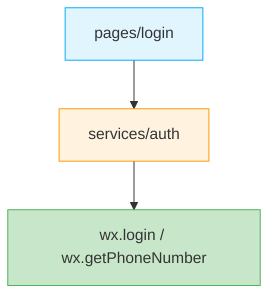
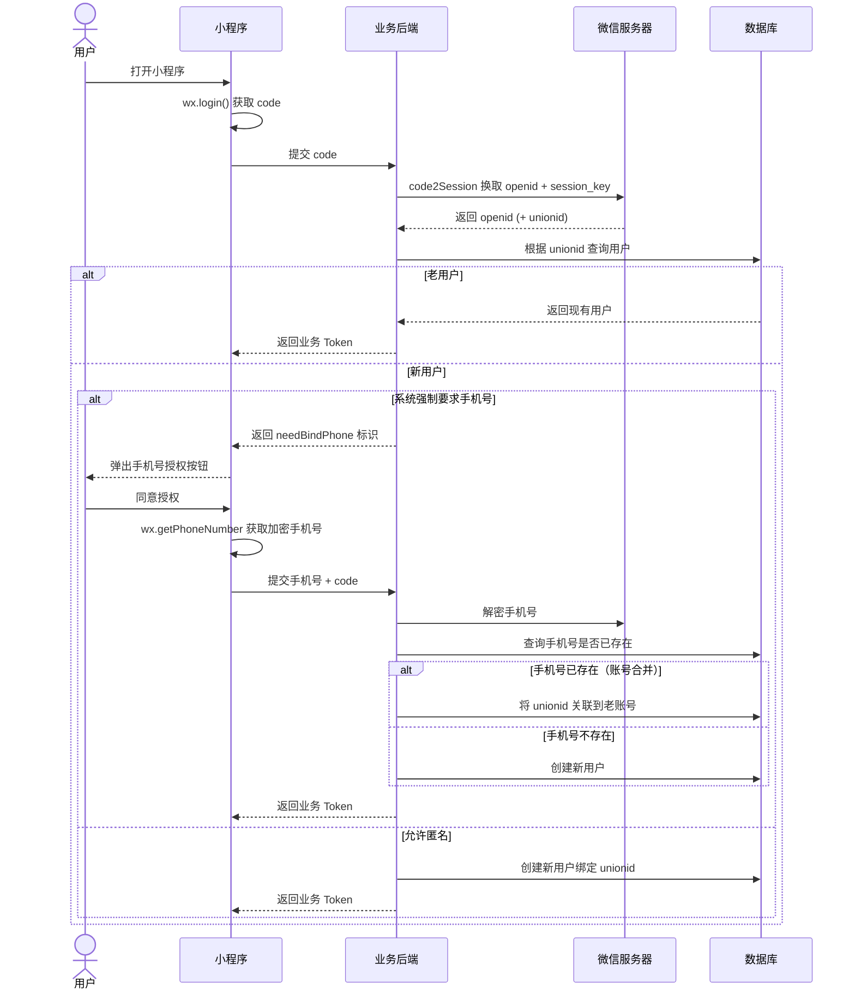

# 认证

小程序认证体系围绕微信生态展开，核心是 `wx.login` 获取 `code` → 后端换取 `session_key` + `openid` → 生成业务 Token。本章节涵盖微信登录、手机号绑定、Token 刷新等场景。

## 子文档

- [微信登录](./wechat/) - `wx.login` 流程、UnionID 账号合并、自动注册
- [短信验证码](./smscode/) - 验证码防刷、自动注册优先策略

## 架构分层



| 层 | 职责 |
|----|------|
| `services/auth` | 封装 `wx.login` / `wx.getPhoneNumber` 为 Promise，并编排登录流程、Token 持久化、自动注册逻辑 |
| `pages/login` | UI 交互，调用 `services/auth` 暴露的登录/绑定流程 |

## 基础理论

### 身份标识：OpenID vs UnionID

- **OpenID**：同一用户在**同一个小程序**下的唯一标识
- **UnionID**：同一用户在同一个微信开放平台账号下的唯一标识

:::tip[强烈建议]
如果产品同时包含小程序、公众号、网站、APP，**务必使用 `UnionID` 作为底层用户的关联主键**，以实现跨端账号同源。需在 [微信开放平台](https://open.weixin.qq.com/) 将小程序绑定到开放平台账号下。
:::

### 自动注册与账号绑定流程



### 多账号合并策略

当系统同时支持「手机号注册」与「微信登录」时，最佳实践：

1. 首次微信登录强制重定向至**手机号绑定页**
2. 后端校验手机号，如果已存在，则将该手机号对应的老账号与当前 `unionid` 关联（合并逻辑）
3. 如果手机号不存在，则真正完成新用户的创建

### CSRF 防护

小程序登录流程中，`wx.login` 返回的 `code` 具有时效性（5 分钟）且一次性，本身具备一定的防重放能力。但仍需注意：

- `code` 应直接传给后端，**不要在前端缓存或日志中记录**
- 后端应校验 `code` 的有效性，避免伪造请求

## 端实现

### wx.login Promise 化

小程序原生 API 是回调风格，需在 `services/auth` 中封装为 Promise：

```ts
// services/auth/login.ts
export const login = (): Promise<string> => {
  return new Promise((resolve, reject) => {
    wx.login({
      success: (res) => {
        if (res.code) {
          resolve(res.code);
        } else {
          reject(new Error(`wx.login 失败: ${res.errMsg}`));
        }
      },
      fail: reject,
    });
  });
};
```

### wx.getPhoneNumber 手机号获取

:::warning[重要变更]
自微信小程序基础库 2.21.2 起，`wx.getPhoneNumber` 不再通过 `e.detail.encryptedData` + `iv` 解密，而是返回 `code`，由后端调用 [`phonenumber.getPhoneNumber`](https://developers.weixin.qq.com/miniprogram/dev/api-backend/open-api/phonenumber/phonenumber.getPhoneNumber.html) 接口换取手机号。新方案更安全，推荐使用。
:::

```wxml
<!-- pages/login/login.wxml -->
<button open-type="getPhoneNumber" bind:getphonenumber="onGetPhoneNumber">
  手机号一键登录
</button>
```

```ts
// pages/login/login.ts
import { bindPhone } from '@/services/auth';

Page({
  async onGetPhoneNumber(e: WechatMiniprogram.ButtonGetPhoneNumber) {
    if (e.detail.errMsg !== 'getPhoneNumber:ok') {
      wx.showToast({ title: '已取消授权', icon: 'none' });
      return;
    }

    try {
      const { token, isNewUser } = await bindPhone(e.detail.code);
      if (isNewUser) {
        wx.redirectTo({ url: '/pages/profile/setup' });
      } else {
        wx.switchTab({ url: '/pages/home/home' });
      }
    } catch (error) {
      wx.showToast({ title: '登录失败', icon: 'error' });
    }
  },
});
```

### Token 持久化与自动注入

```ts
// services/auth/token.ts
import { storage } from '@/services/storage';

const TOKEN_KEY = 'auth_token';
const REFRESH_TOKEN_KEY = 'auth_refresh_token';

export const tokenManager = {
  get(): string | null {
    return storage.get<string>(TOKEN_KEY);
  },

  set(token: string, refreshToken?: string): void {
    storage.set(TOKEN_KEY, token);
    if (refreshToken) {
      storage.set(REFRESH_TOKEN_KEY, refreshToken);
    }
  },

  clear(): void {
    storage.remove(TOKEN_KEY);
    storage.remove(REFRESH_TOKEN_KEY);
  },
};
```

在 `services/http` 拦截器中自动注入 Token，详见 [RESTful API 规范](../../specification/restful/#wxrequest-封装)。

## 实施注意事项

### 1. session_key 的安全

- `session_key` **绝不能下发给前端**，仅在后端使用
- 前端只需保存业务后端下发的 `token`，由后端维护 `session_key` 与 `token` 的映射

### 2. 昵称与头像的处理

:::warning[小程序头像昵称变更]
自 2022 年 10 月 25 日起，小程序 `wx.getUserProfile` / `wx.getUserInfo` 接口返回的 `nickName` 为"微信用户"，`avatarUrl` 为默认灰色头像。需通过以下方式获取真实信息：

- **头像**：使用 `<button open-type="chooseAvatar">` 组件
- **昵称**：使用 `<input type="nickname">` 组件
:::

```wxml
<form bindsubmit="onSubmit">
  <button open-type="chooseAvatar" bind:chooseavatar="onChooseAvatar">
    <image src="{{avatarUrl}}" />
  </button>
  <input type="nickname" name="nickname" placeholder="请输入昵称" />
  <button form-type="submit">保存</button>
</form>
```

### 3. 头像 URL 失效

微信头像 URL 有时效性，**严禁直接在数据库中长期存储微信的绝对路径 URL**。后端在首次注册时应当将头像下载转存至自有 OSS，存储自有 CDN 链接。

### 4. Token 过期处理

在 `services/http` 拦截器中统一处理 `401`：

- 清除本地 token
- 跳转登录页（`wx.reLaunch`，清空页面栈）
- 避免在多个页面重复处理

## 参考资料

- [小程序登录](https://developers.weixin.qq.com/miniprogram/dev/framework/open-ability/login.html)
- [code2Session](https://developers.weixin.qq.com/miniprogram/dev/api-backend/open-api/login/auth.code2Session.html)
- [手机号快速验证](https://developers.weixin.qq.com/miniprogram/dev/api-backend/open-api/phonenumber/phonenumber.getPhoneNumber.html)
- [UnionID 机制](https://developers.weixin.qq.com/miniprogram/dev/framework/open-ability/union-id.html)
