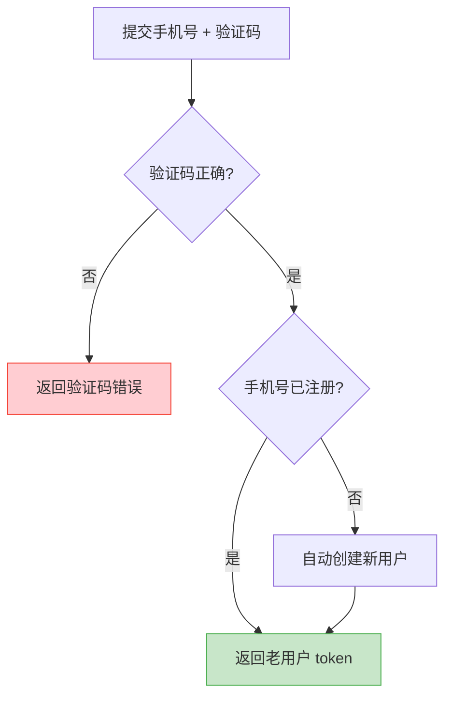

# 短信验证码

短信验证码在小程序中主要用于：手机号绑定、敏感操作二次验证、短信登录（当用户拒绝微信手机号授权时的降级方案）。

## 基础理论

### 验证码防刷策略

短信验证码接口是爬虫和恶意攻击的高频目标，必须多层防护：

| 防护层级 | 策略 | 说明 |
|---------|------|------|
| 前端限制 | 同一手机号 60s 倒计时 | 防止用户误触，体验层防护 |
| 接口限流 | 同一手机号 60s 内 1 次，10 分钟内 5 次，1 小时内 10 次 | 后端基于 Redis 实现 |
| IP 限制 | 同一 IP 每日最多 20 次 | 防止单 IP 刷短信 |
| 图形验证码 | 触发风控后要求图形验证 | 人机识别 |
| 设备指纹 | 基于小程序设备信息识别 | 小程序可获取设备信息有限，依赖后端聚合 |

### 验证码有效期

- **有效期**：5 分钟
- **尝试次数**：同一验证码最多验证 5 次，超过则失效
- **一次性**：验证成功后立即失效，不可重复使用

### 自动注册优先策略

当用户使用短信验证码登录时，后端应遵循"自动注册优先"策略：



## 端实现

### 发送验证码

```ts
// services/auth/sms.ts
import { request } from '@/services/http';

interface SendCodeParams {
  phone: string;
  scene: 'login' | 'bind' | 'reset';
}

export const sendSmsCode = async (params: SendCodeParams): Promise<void> => {
  await request({
    url: '/auth/sms/send',
    method: 'POST',
    data: params,
  });
};
```

### 验证码倒计时

```ts
// utils/useCountdown.ts
export const createCountdown = (duration = 60) => {
  let timer: ReturnType<typeof setInterval> | null = null;
  let remaining = duration;

  const start = (onTick: (remaining: number) => void, onEnd: () => void) => {
    stop();
    remaining = duration;
    onTick(remaining);

    timer = setInterval(() => {
      remaining -= 1;
      onTick(remaining);
      if (remaining <= 0) {
        stop();
        onEnd();
      }
    }, 1000);
  };

  const stop = () => {
    if (timer) {
      clearInterval(timer);
      timer = null;
    }
  };

  return { start, stop };
};
```

### 页面集成

```ts
// pages/login/sms-login.ts
import { sendSmsCode } from '@/services/auth/sms';
import { createCountdown } from '@/utils/useCountdown';

Page({
  data: {
    phone: '',
    code: '',
    countdown: 0,
    loading: false,
  },

  countdown: createCountdown(60),

  onPhoneInput(e: WechatMiniprogram.Input) {
    this.setData({ phone: e.detail.value });
  },

  onCodeInput(e: WechatMiniprogram.Input) {
    this.setData({ code: e.detail.value });
  },

  async onSendCode() {
    if (this.data.countdown > 0) return;

    const phone = this.data.phone;
    if (!/^1[3-9]\d{9}$/.test(phone)) {
      wx.showToast({ title: '手机号格式错误', icon: 'none' });
      return;
    }

    try {
      this.setData({ loading: true });
      await sendSmsCode({ phone, scene: 'login' });
      wx.showToast({ title: '验证码已发送', icon: 'success' });

      this.countdown.start(
        (remaining) => this.setData({ countdown: remaining }),
        () => this.setData({ countdown: 0 }),
      );
    } catch (error) {
      wx.showToast({ title: '发送失败', icon: 'error' });
    } finally {
      this.setData({ loading: false });
    }
  },

  onUnload() {
    this.countdown.stop();
  },
});
```

```wxml
<!-- pages/login/sms-login.wxml -->
<view class="form">
  <input
    type="number"
    maxlength="11"
    placeholder="请输入手机号"
    bindinput="onPhoneInput"
  />
  <view class="code-row">
    <input
      type="number"
      maxlength="6"
      placeholder="请输入验证码"
      bindinput="onCodeInput"
    />
    <button
      disabled="{{countdown > 0 || loading}}"
      bindtap="onSendCode"
    >
      {{countdown > 0 ? `${countdown}s 后重试` : '获取验证码'}}
    </button>
  </view>
</view>
```

## 安全注意事项

### 1. 手机号格式校验

前端校验仅用于提升体验，**后端必须再次校验**：

```ts
const isValidPhone = (phone: string): boolean => {
  return /^1[3-9]\d{9}$/.test(phone);
};
```

### 2. 验证码不明文传输

验证码应通过 HTTPS 传输，**不要拼在 URL QueryString 中**，应放在请求体：

:::tip[正面例子 👍]
```js
await request({
  url: '/auth/sms/verify',
  method: 'POST',
  data: { phone, code },
});
```
:::

:::danger[反面例子 👎]
```js
await request({
  url: `/auth/sms/verify?phone=${phone}&code=${code}`,
});
```
:::

### 3. 与微信手机号授权的优先级

:::tip[推荐策略]
优先引导用户使用 `<button open-type="getPhoneNumber">` 一键授权手机号，体验更好且无需短信成本。短信验证码作为**降级方案**，仅在用户拒绝授权时使用。
:::

## 参考资料

- [短信验证码安全](https://developers.weixin.qq.com/miniprogram/dev/framework/server-ability/message-push.html)
