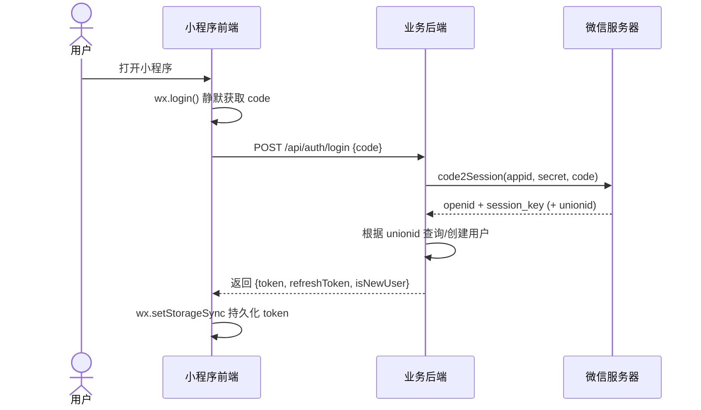

# 微信登录

小程序的微信登录比 Web 简单得多——用户无需扫码、无需授权弹窗，`wx.login` 是静默执行的。本文档说明小程序场景下的登录流程与代码实现。

## 与 Web 场景的差异

| 维度 | Web 场景 | 小程序场景 |
|------|---------|----------|
| 获取 code | 跳转 OAuth 授权页 / 扫码 | `wx.login` 静默调用 |
| 用户授权 | 弹窗确认 | 仅获取手机号、头像等敏感信息时弹窗 |
| OpenID 来源 | 后端用 code 换取 | 后端用 code 调用 `code2Session` |
| UnionID | 需绑定开放平台 | 需绑定开放平台（一致） |
| 登录态 | Cookie / localStorage | `wx.setStorageSync` |

## 登录流程



## 代码实现

### services/auth 层：wx.login Promise 化

```ts
// services/auth/wx-login.ts
export const wxLogin = (): Promise<string> => {
  return new Promise((resolve, reject) => {
    wx.login({
      success: (res) => {
        if (res.code) {
          resolve(res.code);
        } else {
          reject(new Error(`wx.login 失败: ${res.errMsg}`));
        }
      },
      fail: reject,
    });
  });
};
```

### services/auth 层：登录流程编排

```ts
// services/auth/login.ts
import { wxLogin } from '@/services/auth';
import { request } from '@/services/http';
import { tokenManager } from './token';

interface LoginResult {
  token: string;
  refreshToken: string;
  isNewUser: boolean;
}

export const login = async (): Promise<LoginResult> => {
  // 1. 获取 code
  const code = await wxLogin();

  // 2. 用 code 换取业务 token
  const result = await request<LoginResult>({
    url: '/auth/login',
    method: 'POST',
    data: { code },
  });

  // 3. 持久化 token
  tokenManager.set(result.token, result.refreshToken);

  return result;
};
```

### pages 层：调用登录

```ts
// pages/login/login.ts
import { login } from '@/services/auth';

Page({
  data: { loading: false },

  async onLoad() {
    // 进入页面即静默登录
    await this.silentLogin();
  },

  async silentLogin() {
    this.setData({ loading: true });
    try {
      const { isNewUser } = await login();
      if (isNewUser) {
        // 新用户跳转手机号绑定页
        wx.redirectTo({ url: '/pages/login/bind-phone' });
      } else {
        wx.switchTab({ url: '/pages/home/home' });
      }
    } catch (error) {
      wx.showToast({ title: '登录失败，请重试', icon: 'error' });
    } finally {
      this.setData({ loading: false });
    }
  },
});
```

## Token 刷新

当业务 token 过期时，使用 `refreshToken` 静默续期，避免用户被强制登出。

```ts
// services/http/interceptor.ts
import { tokenManager } from '@/services/auth/token';

let isRefreshing = false;
let pendingRequests: Array<() => void> = [];

export const refreshToken = async (): Promise<string> => {
  const refreshToken = tokenManager.getRefreshToken();
  if (!refreshToken) {
    throw new Error('No refresh token');
  }

  const { token, refreshToken: newRefreshToken } = await request<{
    token: string;
    refreshToken: string;
  }>({
    url: '/auth/refresh',
    method: 'POST',
    data: { refreshToken },
  });

  tokenManager.set(token, newRefreshToken);
  return token;
};

// 在响应拦截器中处理 401
const handle401 = async (retryRequest: () => Promise<unknown>) => {
  if (isRefreshing) {
    // 排队等待刷新完成
    return new Promise((resolve, reject) => {
      pendingRequests.push(() => {
        retryRequest().then(resolve).catch(reject);
      });
    });
  }

  isRefreshing = true;
  try {
    await refreshToken();
    // 刷新成功，重放排队的请求
    pendingRequests.forEach((cb) => cb());
    pendingRequests = [];
    return retryRequest();
  } catch (error) {
    // 刷新失败，清除 token 并跳转登录
    tokenManager.clear();
    pendingRequests = [];
    wx.reLaunch({ url: '/pages/login/login' });
    throw error;
  } finally {
    isRefreshing = false;
  }
};
```

## 登录态恢复

小程序冷启动时需检查本地 token 是否有效：

```ts
// app.ts
import { tokenManager } from '@/services/auth/token';

App({
  onLaunch() {
    const token = tokenManager.get();
    if (!token) {
      // 无 token，跳转登录
      wx.reLaunch({ url: '/pages/login/login' });
      return;
    }

    // 可选：调用 /api/auth/check 校验 token 有效性
    // 失败则走 refresh 流程
  },
});
```

## 安全注意事项

### 1. AppSecret 永不下发前端

`AppSecret` 仅在后端使用，用于调用 `code2Session`。**绝不能在小程序代码中出现**，否则会被反编译窃取。

### 2. code 的时效性

`wx.login` 返回的 `code` 有效期为 5 分钟，且只能使用一次。前端拿到后应立即传给后端，不要缓存。

### 3. session_key 不下发

`session_key` 仅在后端用于解密微信加密数据（如旧版手机号），**绝不能下发给前端**。

## 参考资料

- [小程序登录](https://developers.weixin.qq.com/miniprogram/dev/framework/open-ability/login.html)
- [code2Session 接口](https://developers.weixin.qq.com/miniprogram/dev/api-backend/open-api/login/auth.code2Session.html)
