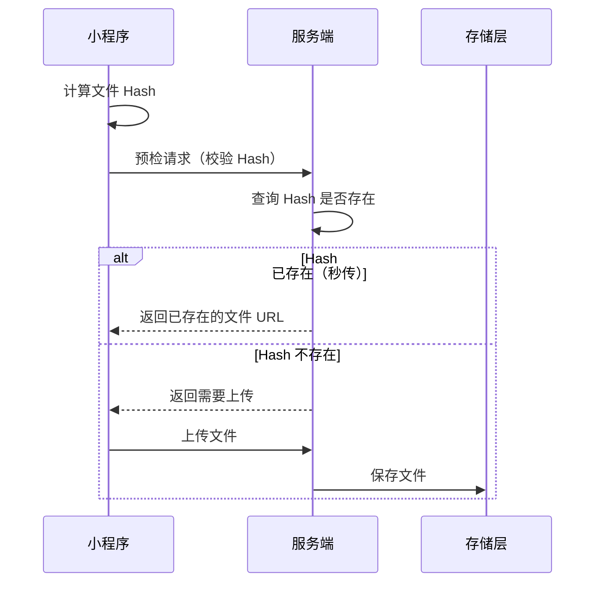

# 文件上传

小程序的文件上传能力受平台 API 限制，与 Web 场景差异较大。本文档说明小程序场景下的上传方案，并指出与 Web 方案的差异。

## 与 Web 场景的差异

| 维度 | Web 场景 | 小程序场景 |
|------|---------|----------|
| 上传 API | `fetch` + `FormData` | `wx.uploadFile` |
| 文件选择 | `<input type="file">` | `wx.chooseImage` / `wx.chooseMessageFile` / `wx.chooseMedia` |
| 分片上传 | `File.slice()` + 并发控制 | **不支持** `Blob.slice`，分片能力受限 |
| 断点续传 | 基于 `File.slice` 实现 | 仅能模拟，无法真正分片 |
| 进度监听 | `XMLHttpRequest.upload.onprogress` | `wx.uploadFile` 的 `onProgressUpdate` |

:::warning[小程序限制]
小程序**不支持 `FormData` 对象**，`wx.uploadFile` 通过 `filePath` + `name` + `formData` 参数传递文件与附加字段。`formData` 只能是简单键值对，不能嵌套对象。
:::

## 基础理论

### 秒传（Checksum 校验）

通过计算文件哈希值，实现文件级去重：



### 多层校验

- **前端预检**：文件类型、大小、数量
- **文件魔数校验**：后端校验文件真实类型，防止伪造扩展名
- **服务端防病毒扫描**：可选，对接专业安全服务

## 端实现

### services/http 层：封装 wx.uploadFile

```ts
// services/http/upload.ts
interface UploadConfig {
  url: string;
  filePath: string;
  name?: string;
  formData?: Record<string, string>;
  header?: Record<string, string>;
}

interface UploadResult {
  data: string;
  statusCode: number;
}

export const uploadFile = (config: UploadConfig): Promise<UploadResult> => {
  return new Promise((resolve, reject) => {
    const task = wx.uploadFile({
      url: config.url,
      filePath: config.filePath,
      name: config.name ?? 'file',
      formData: config.formData,
      header: config.header,
      success: (res) => {
        if (res.statusCode >= 200 && res.statusCode < 300) {
          resolve(res);
        } else {
          reject(res);
        }
      },
      fail: reject,
    });

    // 返回 task 以便调用方监听进度、取消上传
    return task;
  });
};

// 带进度回调的上传
export const uploadFileWithProgress = (
  config: UploadConfig,
  onProgress?: (progress: number) => void,
): Promise<UploadResult> => {
  return new Promise((resolve, reject) => {
    const task = wx.uploadFile({
      url: config.url,
      filePath: config.filePath,
      name: config.name ?? 'file',
      formData: config.formData,
      header: config.header,
      success: (res) => {
        if (res.statusCode >= 200 && res.statusCode < 300) {
          resolve(res);
        } else {
          reject(res);
        }
      },
      fail: reject,
    });

    if (onProgress) {
      task.onProgressUpdate((res) => {
        onProgress(res.progress);
      });
    }
  });
};
```

### services/upload 层：上传流程编排

```ts
// services/upload/upload.ts
import { uploadFileWithProgress } from '@/services/http';
import { request } from '@/services/http';

interface FileResult {
  id: string;
  url: string;
  name: string;
}

interface UploadOptions {
  filePath: string;
  bizType?: string;
  onProgress?: (progress: number) => void;
}

const BASE_URL = 'https://api.example.com/api';

export const uploadFile = async (options: UploadOptions): Promise<FileResult> => {
  // 1. 前端预检：文件大小、类型
  // （wx.chooseImage 已返回文件信息，可在此校验）

  // 2. 上传文件
  const result = await uploadFileWithProgress(
    {
      url: `${BASE_URL}/file`,
      filePath: options.filePath,
      name: 'file',
      formData: options.bizType ? { bizType: options.bizType } : undefined,
    },
    options.onProgress,
  );

  // 3. 解析响应
  return JSON.parse(result.data) as FileResult;
};
```

### pages 层：图片上传

```ts
// pages/profile/avatar.ts
import { uploadFile } from '@/services/upload';

Page({
  data: {
    avatarUrl: '',
    uploading: false,
    progress: 0,
  },

  async onChooseAvatar() {
    try {
      const res = await wx.chooseMedia({
        count: 1,
        mediaType: ['image'],
        sizeType: ['compressed'],
        sourceType: ['album', 'camera'],
      });

      const tempFilePath = res.tempFiles[0].tempFilePath;

      // 校验文件大小（2MB）
      const fileInfo = await wx.getFileInfo({ filePath: tempFilePath });
      if (fileInfo.size > 2 * 1024 * 1024) {
        wx.showToast({ title: '图片不能超过 2MB', icon: 'none' });
        return;
      }

      this.setData({ uploading: true, progress: 0 });

      const result = await uploadFile({
        filePath: tempFilePath,
        bizType: 'avatar',
        onProgress: (progress) => {
          this.setData({ progress });
        },
      });

      this.setData({ avatarUrl: result.url });
      wx.showToast({ title: '上传成功', icon: 'success' });
    } catch (error) {
      wx.showToast({ title: '上传失败', icon: 'error' });
    } finally {
      this.setData({ uploading: false });
    }
  },
});
```

```wxml
<!-- pages/profile/avatar.wxml -->
<view class="avatar-uploader">
  <image src="{{avatarUrl}}" mode="aspectFill" />
  <button bindtap="onChooseAvatar" disabled="{{uploading}}">
    {{uploading ? '上传中 {{progress}}%' : '选择头像'}}
  </button>
</view>
```

## 多文件上传

小程序的 `wx.uploadFile` 一次只能上传一个文件，多文件需循环调用：

```ts
// services/upload/uploadMultiple.ts
import { uploadFile } from './upload';
import type { FileResult } from './upload';

interface UploadMultipleOptions {
  filePaths: string[];
  bizType?: string;
  onProgress?: (current: number, total: number) => void;
  concurrency?: number;
}

export const uploadMultiple = async (
  options: UploadMultipleOptions,
): Promise<FileResult[]> => {
  const { filePaths, concurrency = 3 } = options;
  const results: FileResult[] = [];
  let completed = 0;

  // 简单的并发控制
  const queue = [...filePaths];
  const running: Promise<void>[] = [];

  const runNext = async (): Promise<void> => {
    const filePath = queue.shift();
    if (!filePath) return;

    const result = await uploadFile({
      filePath,
      bizType: options.bizType,
    });
    results.push(result);
    completed += 1;
    options.onProgress?.(completed, filePaths.length);

    // 继续处理队列
    if (queue.length > 0) {
      await runNext();
    }
  };

  // 启动并发
  for (let i = 0; i < Math.min(concurrency, filePaths.length); i += 1) {
    running.push(runNext());
  }

  await Promise.all(running);
  return results;
};
```

## 大文件上传的限制

:::warning[小程序大文件限制]
小程序**无法像 Web 一样使用 `Blob.slice` 进行真正的分片上传**。`wx.uploadFile` 是整文件上传，受以下限制：

- 单次上传大小限制：50MB（部分平台更低）
- 无法实现真正的断点续传
- 网络中断后必须重新上传整个文件

**应对策略**：

1. **客户端压缩**：上传前用 `wx.compressImage` 压缩图片
2. **分片模拟**：对于超大文件，引导用户使用 Web 端上传
3. **直传 OSS**：使用微信云存储或后端返回 STS 临时凭证，前端直传 OSS
:::

## 直传 OSS 方案

对于大文件，推荐前端直传 OSS，绕过后端带宽瓶颈：

```ts
// services/upload/uploadToOss.ts
import { request } from '@/services/http';

interface OssConfig {
  uploadUrl: string;
  key: string;
  policy: string;
  signature: string;
  ossAccessKeyId: string;
  callback: string;
}

export const uploadToOss = async (
  filePath: string,
  onProgress?: (progress: number) => void,
): Promise<string> => {
  // 1. 从后端获取 STS 临时凭证
  const ossConfig = await request<OssConfig>({
    url: '/upload/sts',
    method: 'POST',
  });

  // 2. 直传 OSS
  return new Promise((resolve, reject) => {
    const task = wx.uploadFile({
      url: ossConfig.uploadUrl,
      filePath,
      name: 'file',
      formData: {
        key: ossConfig.key,
        policy: ossConfig.policy,
        signature: ossConfig.signature,
        ossaccessKeyId: ossConfig.ossAccessKeyId,
        callback: ossConfig.callback,
      },
      success: (res) => {
        if (res.statusCode === 200) {
          resolve(ossConfig.key);
        } else {
          reject(res);
        }
      },
      fail: reject,
    });

    if (onProgress) {
      task.onProgressUpdate((res) => onProgress(res.progress));
    }
  });
};
```

## 安全注意事项

### 1. 文件类型校验

前端校验文件扩展名，**后端必须校验文件魔数**：

```ts
const ALLOWED_TYPES = ['jpg', 'jpeg', 'png', 'gif'];

const isAllowedType = (filePath: string): boolean => {
  const ext = filePath.split('.').pop()?.toLowerCase() ?? '';
  return ALLOWED_TYPES.includes(ext);
};
```

### 2. 文件大小限制

前端预检文件大小，减轻服务端压力：

```ts
const MAX_SIZE = 10 * 1024 * 1024; // 10MB

const checkFileSize = async (filePath: string): Promise<boolean> => {
  const info = await wx.getFileInfo({ filePath });
  return info.size <= MAX_SIZE;
};
```

### 3. 上传凭证

- 上传接口应携带 `Authorization` token
- 直传 OSS 时使用 STS 临时凭证，**不暴露永久密钥**

## 参考资料

- [wx.uploadFile](https://developers.weixin.qq.com/miniprogram/dev/api/network/upload/wx.uploadFile.html)
- [wx.chooseMedia](https://developers.weixin.qq.com/miniprogram/dev/api/media/video/wx.chooseMedia.html)
- [wx.chooseMessageFile](https://developers.weixin.qq.com/miniprogram/dev/api/media/file/wx.chooseMessageFile.html)
