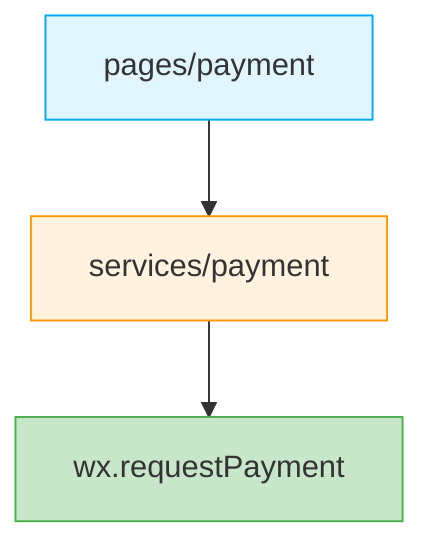

# 支付

本章节记录小程序支付业务的实现方案。

## 子文档

- [微信支付](./weixinpay/) - 小程序支付调起、订单状态同步

## 架构分层

| 层 | 职责 |
|----|------|
| `services/payment` | 封装 `wx.requestPayment` 为 Promise，并编排创建订单、轮询订单状态、支付结果回调 |
| `pages/payment` | 支付 UI、用户交互，调用 `services/payment` |
