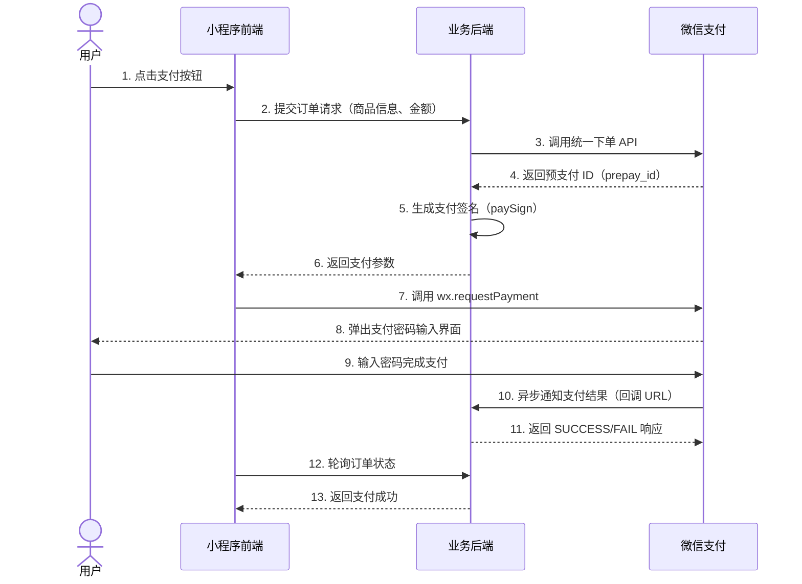

# 微信支付

## 简介

小程序支付是微信支付的一种场景，用户在小程序内发起支付，由小程序调起微信支付模块完成付款。与 Web 的 JSAPI 支付相比，小程序支付**无需配置 JSSDK**，直接调用 `wx.requestPayment` 即可。

## 与 Web 场景的差异

| 维度 | Web JSAPI 支付 | 小程序支付 |
|------|--------------|----------|
| 调起方式 | `wx.chooseWXPay`（JSSDK） | `wx.requestPayment`（原生 API） |
| JSSDK 配置 | 需 `wx.config` 注入签名 | 不需要 |
| openid 来源 | 后端通过 OAuth 获取 | 后端通过 `code2Session` 获取 |
| 支付参数 | appId、timeStamp、nonceStr、package、paySign | 一致 |
| 回调通知 | 一致 | 一致 |

## 基础理论

### 支付流程



### 订单状态同步策略

支付完成后，**不能仅依赖前端 `success` 回调**判断支付成功，必须以后端为准：

1. **前端回调**：`wx.requestPayment` 的 `success` 仅表示用户完成了支付操作，不代表支付真的成功
2. **后端回调**：微信支付服务器异步通知后端，后端更新订单状态
3. **前端轮询**：前端在 `success` 回调后轮询后端订单接口，确认最终状态

## 端实现

### services/payment 层：封装 wx.requestPayment

```ts
// services/payment/requestPayment.ts
interface PaymentParams {
  timeStamp: string;
  nonceStr: string;
  package: string;
  signType: 'RSA' | 'MD5';
  paySign: string;
}

export const requestPayment = (params: PaymentParams): Promise<void> => {
  return new Promise((resolve, reject) => {
    wx.requestPayment({
      timeStamp: params.timeStamp,
      nonceStr: params.nonceStr,
      package: params.package,
      signType: params.signType,
      paySign: params.paySign,
      success: () => resolve(),
      fail: (err) => reject(err),
    });
  });
};
```

### services/payment 层：支付流程编排

```ts
// services/payment/pay.ts
import { request } from '@/services/http';
import { requestPayment } from '@/services/payment';

interface CreateOrderParams {
  productId: string;
  quantity: number;
}

interface PaymentResult {
  success: boolean;
  orderNo: string;
}

export const pay = async (params: CreateOrderParams): Promise<PaymentResult> => {
  // 1. 创建订单，获取支付参数
  const paymentParams = await request<{
    orderNo: string;
    timeStamp: string;
    nonceStr: string;
    package: string;
    signType: 'RSA' | 'MD5';
    paySign: string;
  }>({
    url: '/payment/orders',
    method: 'POST',
    data: params,
  });

  const { orderNo, ...payParams } = paymentParams;

  // 2. 调起微信支付
  try {
    await requestPayment(payParams);
  } catch (error) {
    // 用户取消支付或支付失败
    return { success: false, orderNo };
  }

  // 3. 轮询订单状态，确认支付结果
  const result = await pollOrderStatus(orderNo);
  return { success: result, orderNo };
};

// 轮询订单状态（最多 5 次，每次间隔 1s）
const pollOrderStatus = async (orderNo: string): Promise<boolean> => {
  const MAX_RETRY = 5;
  const INTERVAL = 1000;

  for (let i = 0; i < MAX_RETRY; i += 1) {
    await new Promise((resolve) => setTimeout(resolve, INTERVAL));

    const order = await request<{ status: 'pending' | 'paid' | 'failed' }>({
      url: `/payment/orders/${orderNo}`,
      method: 'GET',
    });

    if (order.status === 'paid') return true;
    if (order.status === 'failed') return false;
  }

  return false;
};
```

### pages 层：支付 UI

```ts
// pages/payment/payment.ts
import { pay } from '@/services/payment';

Page({
  data: {
    productId: '',
    quantity: 1,
    loading: false,
  },

  async onPayTap() {
    this.setData({ loading: true });
    try {
      const { success, orderNo } = await pay({
        productId: this.data.productId,
        quantity: this.data.quantity,
      });

      if (success) {
        wx.showToast({ title: '支付成功', icon: 'success' });
        setTimeout(() => {
          wx.redirectTo({ url: `/pages/order/detail?orderNo=${orderNo}` });
        }, 1500);
      } else {
        wx.showToast({ title: '支付未完成', icon: 'none' });
      }
    } catch (error) {
      wx.showToast({ title: '支付失败', icon: 'error' });
    } finally {
      this.setData({ loading: false });
    }
  },
});
```

## 后端实现

后端统一下单与签名生成的逻辑与 Web 场景一致，此处仅列出关键差异点：

### 1. openid 获取

小程序支付的统一下单接口需要 `openid`，后端通过 `code2Session` 获取：

```java
// Java 示例：从 code 获取 openid
public String getOpenid(String code) {
    WxMaJscode2SessionResult session = wxMaService.jsCode2SessionInfo(code);
    return session.getOpenid();
}
```

### 2. 支付参数签名

小程序支付的签名参数与 JSAPI 一致：

```java
// Java 示例：生成小程序支付参数
public Map<String, String> buildPaymentParams(String prepayId) {
    Map<String, String> params = new HashMap<>();
    params.put("appId", appId);
    params.put("timeStamp", String.valueOf(System.currentTimeMillis() / 1000));
    params.put("nonceStr", UUID.randomUUID().toString().replace("-", ""));
    params.put("package", "prepay_id=" + prepayId);
    params.put("signType", "RSA");
    params.put("paySign", sign(params));
    return params;
}
```

### 3. 回调通知

回调通知处理与 Web 场景完全一致，详见 [微信支付开发文档](https://pay.weixin.qq.com/wiki/doc/apiv3/index.shtml)。

## 配置

```json
{
  "wxpay": {
    "appId": "your_app_id",
    "mchId": "your_mch_id",
    "apiKey": "your_api_key",
    "privateKeyPath": "./cert/apiclient_key.pem",
    "notifyUrl": "https://your-domain.com/api/wxpay/notify"
  }
}
```

## 安全注意事项

### 1. 金额校验

- 前端展示的金额仅用于展示，**后端必须以数据库中的金额为准**
- 创建订单时，后端根据 `productId` 查询价格，不信任前端传入的金额

### 2. 防重复支付

- 后端在创建订单时校验是否已存在未支付的订单
- 前端在调起支付前检查订单状态，避免重复调起

### 3. 回调验签

后端接收微信支付回调时，**必须验证签名**，防止伪造通知：

```java
// 验证回调签名
if (!verifyNotifySign(notification, signature)) {
    throw new SecurityException("Invalid signature");
}
```

### 4. 订单超时

- 设置合理的订单超时时间（如 30 分钟）
- 超时后自动关闭订单，释放库存
- 前端在支付页展示倒计时，超时后引导用户重新下单

## 参考资料

- [小程序支付开发指南](https://pay.weixin.qq.com/wiki/doc/apiv3/open/pay/chapter2_8.shtml)
- [wx.requestPayment](https://developers.weixin.qq.com/miniprogram/dev/api/payment/wx.requestPayment.html)
- [小程序支付接入流程](https://developers.weixin.qq.com/miniprogram/dev/framework/open-ability/payment.html)
