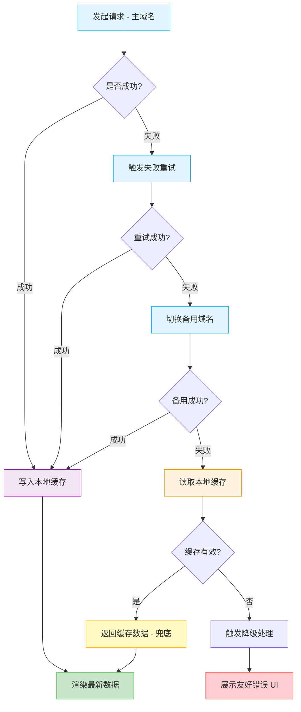

# 接口请求兜底容灾

基于 `wx.setStorage` 的小程序接口请求容灾解决方案，提供多层级的容错机制，确保在极端网络或服务异常情况下，让小程序依然"坚不可摧"。

## 与 Web 场景的差异

| 维度 | Web 场景 | 小程序场景 |
|------|---------|----------|
| 本地存储 | `IndexedDB`（大容量、支持索引） | `wx.setStorage`（容量 10MB、无索引） |
| 存储库 | `localforage` | 原生 `wx.setStorageSync` |
| 数据请求 | `axios` + TanStack Query | `wx.request` + 自行封装 |
| Service Worker | 支持（离线缓存） | 不支持 |
| 重试机制 | 一致 | 一致 |

:::warning[小程序限制]
- `wx.setStorage` 单个 key 上限 1MB，总容量上限 10MB
- 不支持 `IndexedDB`，无法存储大体积缓存
- 没有 Service Worker，离线能力依赖本地存储
:::

## 基础理论

### 四级递进容灾策略



| 层级 | 策略 | 说明 |
|------|------|------|
| 1 | 主域名请求 | 默认请求路径 |
| 2 | 失败重试 | 网络抖动时自动重试 2-3 次 |
| 3 | 备用域名 | 主域名持续失败时切换备用域名 |
| 4 | 本地缓存兜底 | 所有请求失败时读取本地缓存 |

### 缓存策略

- **写入时机**：请求成功后立即写入缓存
- **有效期**：每个缓存项设置 `expire` 时间戳，过期则视为无效
- **容量控制**：定期清理过期缓存，避免超过 10MB 限制

## 端实现

### services/storage 层：带过期的缓存

```ts
// services/storage/cache.ts
interface CacheItem<T> {
  data: T;
  expire: number;
  cachedAt: number;
}

export const cache = {
  get<T>(key: string): T | null {
    try {
      const value = wx.getStorageSync(key);
      if (!value) return null;

      const item = value as CacheItem<T>;
      if (item.expire && Date.now() > item.expire) {
        wx.removeStorageSync(key);
        return null;
      }
      return item.data;
    } catch {
      return null;
    }
  },

  set<T>(key: string, data: T, ttl: number): void {
    const item: CacheItem<T> = {
      data,
      expire: Date.now() + ttl,
      cachedAt: Date.now(),
    };
    try {
      wx.setStorageSync(key, item);
    } catch (error) {
      // 存储已满，清理过期缓存后重试
      cleanExpiredCache();
      try {
        wx.setStorageSync(key, item);
      } catch {
        // 仍然失败，放弃缓存
        console.warn('缓存写入失败', error);
      }
    }
  },

  remove(key: string): void {
    wx.removeStorageSync(key);
  },
};

// 清理过期缓存
const cleanExpiredCache = (): void => {
  try {
    const info = wx.getStorageInfoSync();
    info.keys.forEach((key) => {
      const value = wx.getStorageSync(key);
      if (value?.expire && Date.now() > value.expire) {
        wx.removeStorageSync(key);
      }
    });
  } catch {
    // 忽略清理失败
  }
};
```

### services/http 层：容灾请求封装

```ts
// services/http/fallback.ts
import { cache } from '@/services/storage/cache';

const PRIMARY_DOMAIN = 'https://api.example.com';
const BACKUP_DOMAINS = [
  'https://backup1.example.com',
  'https://backup2.example.com',
];

const MAX_RETRY = 2;
const CACHE_TTL = 5 * 60 * 1000; // 5 分钟

interface FallbackConfig {
  url: string;
  method?: 'GET' | 'POST' | 'PUT' | 'PATCH' | 'DELETE';
  data?: Record<string, unknown>;
  fallbackEnabled?: boolean; // 是否启用容灾，默认仅 GET 启用
  cacheKey?: string; // 自定义缓存 key
}

const requestWithDomain = (
  domain: string,
  config: FallbackConfig,
): Promise<unknown> => {
  return new Promise((resolve, reject) => {
    wx.request({
      url: `${domain}/api${config.url}`,
      method: config.method ?? 'GET',
      data: config.data,
      success: (res) => {
        if (res.statusCode >= 200 && res.statusCode < 300) {
          resolve(res.data);
        } else {
          reject(res);
        }
      },
      fail: reject,
    });
  });
};

const sleep = (ms: number): Promise<void> =>
  new Promise((resolve) => setTimeout(resolve, ms));

export const fallbackRequest = async <T = unknown>(
  config: FallbackConfig,
): Promise<T> => {
  const { fallbackEnabled = config.method === 'GET' } = config;
  const cacheKey = config.cacheKey ?? `cache:${config.url}`;

  // 1. 尝试主域名
  try {
    const data = await requestWithDomain(PRIMARY_DOMAIN, config);
    if (fallbackEnabled) {
      cache.set(cacheKey, data, CACHE_TTL);
    }
    return data as T;
  } catch (error) {
    if (!fallbackEnabled) throw error;
  }

  // 2. 重试
  for (let i = 0; i < MAX_RETRY; i += 1) {
    await sleep(1000 * (i + 1));
    try {
      const data = await requestWithDomain(PRIMARY_DOMAIN, config);
      cache.set(cacheKey, data, CACHE_TTL);
      return data as T;
    } catch {
      // 继续尝试
    }
  }

  // 3. 切换备用域名
  for (const domain of BACKUP_DOMAINS) {
    try {
      const data = await requestWithDomain(domain, config);
      cache.set(cacheKey, data, CACHE_TTL);
      return data as T;
    } catch {
      // 继续尝试
    }
  }

  // 4. 读取本地缓存兜底
  const cached = cache.get<T>(cacheKey);
  if (cached) {
    console.warn(`使用缓存数据: ${cacheKey}`);
    return cached;
  }

  // 5. 所有策略失败，抛出错误
  throw new Error('所有容灾策略均失败');
};
```

### 在 services 业务模块中使用

```ts
// services/product/list.ts
import { fallbackRequest } from '@/services/http/fallback';

interface Product {
  id: string;
  name: string;
  price: number;
}

export const fetchProducts = (): Promise<Product[]> => {
  return fallbackRequest<Product[]>({
    url: '/products',
    method: 'GET',
    fallbackEnabled: true,
    cacheKey: 'cache:products:list',
  });
};
```

### 在 pages 层处理降级

```ts
// pages/product/list.ts
import { fetchProducts } from '@/services/product/list';

Page({
  data: {
    products: [] as Product[],
    loading: true,
    error: false,
    usingCache: false,
  },

  async onLoad() {
    try {
      const products = await fetchProducts();
      this.setData({ products, loading: false });
    } catch (error) {
      // 所有容灾策略失败，展示降级 UI
      this.setData({ loading: false, error: true });
      wx.showToast({ title: '网络异常，请稍后重试', icon: 'none' });
    }
  },

  onRetry() {
    this.setData({ loading: true, error: false });
    this.onLoad();
  },
});
```

```wxml
<!-- pages/product/list.wxml -->
<view wx:if="{{loading}}">加载中...</view>

<view wx:elif="{{error}}">
  <view>网络异常</view>
  <button bindtap="onRetry">重试</button>
</view>

<view wx:else>
  <view wx:if="{{usingCache}}" class="cache-tip">
    当前展示为缓存数据，可能不是最新
  </view>
  <view wx:for="{{products}}" wx:key="id">
    {{item.name}}
  </view>
</view>
```

## 容灾策略选择指南

| 接口类型 | 是否启用容灾 | 缓存 TTL | 说明 |
|---------|------------|---------|------|
| 商品列表、文章列表 | ✔️ | 5 分钟 | 高频读，可接受短暂过期 |
| 用户信息 | ✔️ | 1 分钟 | 短期缓存，避免频繁请求 |
| 配置信息 | ✔️ | 1 小时 | 低频变更，可长期缓存 |
| 创建订单、支付 | ❌ | - | 写操作，禁止使用缓存 |
| 实时数据（股价、库存） | ❌ | - | 强一致性要求，不缓存 |

## 容量管理

由于 `wx.setStorage` 总容量仅 10MB，需谨慎管理缓存：

```ts
// services/storage/cacheManager.ts
const MAX_CACHE_SIZE = 5 * 1024 * 1024; // 预留 5MB 给缓存

export const checkStorageSize = (): boolean => {
  try {
    const info = wx.getStorageInfoSync();
    return info.currentSize * 1024 < MAX_CACHE_SIZE;
  } catch {
    return false;
  }
};

// 缓存写入前检查容量
export const safeSetCache = <T>(key: string, data: T, ttl: number): void => {
  if (!checkStorageSize()) {
    cleanExpiredCache();
  }
  if (checkStorageSize()) {
    cache.set(key, data, ttl);
  }
};
```

## 监控与可观测

在容灾触发时记录日志，便于后续分析：

```ts
interface FallbackLog {
  url: string;
  strategy: 'primary' | 'retry' | 'backup' | 'cache';
  timestamp: number;
  success: boolean;
}

const logFallback = (log: FallbackLog): void => {
  console.warn('[fallback]', log);
  // 可选：上报到监控服务
};
```

## 参考资料

- [wx.setStorage](https://developers.weixin.qq.com/miniprogram/dev/api/storage/wx.setStorage.html)
- [wx.getStorageInfo](https://developers.weixin.qq.com/miniprogram/dev/api/storage/wx.getStorageInfo.html)
- [小程序存储限制](https://developers.weixin.qq.com/miniprogram/dev/framework/ability/storage.html)
