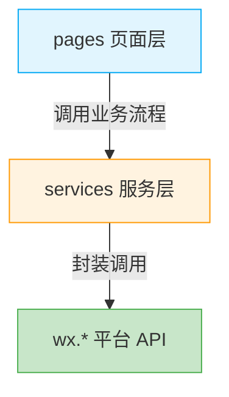

# 架构

:::tip
目前仅支持微信小程序，对于其他小程序平台暂时不予考虑。
:::


| 特性/平台          | 微信小程序                                                                   |
|----------------|-------------------------------------------------------------------------|
| 开发方式           | 原生微信小程序                                                                 |
| NPM 支持         | ✔️                                                                      |
| UI 组件/框架       | [TDesign MiniProgram](https://tdesign.tencent.com/miniprogram/overview) |
|                | [Vant Weapp](https://vant-ui.github.io/vant-weapp/)                     |
| TypeScript     | ✔️                                                                      |
| Sass           | ✔️                                                                      |
| 渲染引擎           | Skyline（推荐）/ WebView                                                    |
| 状态管理           | mobx-miniprogram + bindings                                             |
| ESLint         | airbnb                                                                  |
| stylelint      | Bootstrap                                                               |
| 单元测试           | 🚧工作进行中                                                                 |
|                | Jest + MiniProgram Simulate                                             |
| E2E 测试         | miniprogram-automator                                                   |
| MiniProgram CI | ✔️                                                                      |
| 云开发            | ❌不支持                                                                    |

- 使用原生小程序开发方式，降低学习成本
- 支持 npm 使用第三方工具包
- 严格的代码检查工具，提升代码维护性：包括 ESLint、stylelint
- 提供 CI 支持自动化构建和上传
- 支持使用 TypeScript 和 Sass，提供更好的开发体验
- 支持 Skyline 渲染引擎与 mobx-miniprogram 状态管理
- 支持小程序自动化测试（组件测试 + E2E）

:::warning
对于 UI 组件，推荐使用 [TDesign MiniProgram](https://tdesign.tencent.com/miniprogram/overview) 或 [Vant Weapp](https://vant-ui.github.io/vant-weapp/)，可以根据实际情况进行选择。
:::

## 为什么选择原生开发

针对小程序业务（如微信小程序、支付宝小程序等），本指南倾向于使用**原生小程序开发**。由于各渠道小程序的使用场景、业务定位、交互设计和核心心智完全不同，在实际业务演进中并不存在强烈的"万能代码通配跨端"诉求。

使用原生开发的核心收益：

- **100% 释放平台专有 API 和原生性能**，彻底免除多端框架带来的语法折损和抹平维护黑洞
- **工具链透明**：构建流程可控，异常排查链路清晰，不依赖特定 IDE
- **生态纯粹**：可直接使用平台官方组件、扩展能力与最新特性
- **质量保障**：可集成官方提供的 `miniprogram-ci`、`miniprogram-simulate` 等工具进行深度测试

:::warning[放弃 uni-app / Taro 的理由]
"一次编写、多端发布"在实际大型项目中极易沦为"一处编写、到处调试"的兼容陷阱：

- 多端转译充斥条件编译与平台限制，后期维护成本呈指数级上升
- 深度绑定特定脚手架，构建流程属于黑盒工程，异常排查门槛极高
- 严重依赖专属插件市场，大量标准 npm 库在多端转译时存在运行时报错风险
- 由于专有的非标准运行时限制，很难引入现代化的测试工具链进行深度质量保障

如果业务确实存在多端诉求，建议**各端原生独立开发**，仅在"业务逻辑层"共享设计思路与文档，而非强行跨端代码复用。
:::

## 分层架构

原生小程序开发最大的隐患是“业务流程与平台 API 耦合”——一旦 `wx.request`、`wx.login`、`wx.storage` 散落在页面里，业务流程就被技术细节淹没，难以单测、难以排查、难以演进。为了把“业务流程”从“平台调用”中拎出来，本指南推荐 **`pages` / `services` 两层结构**：

- `pages` 只负责 UI 渲染、用户交互、调用业务流程；
- `services` 收口所有业务相关的平台 API（网络、存储、登录、支付等）和业务流程编排。



**分层原则**：

| 层级 | 职责 | 依赖规则 |
|------|------|---------|
| `pages` | UI 渲染、用户交互、调用 `services` | 可调用 UI 类 `wx.*`（`wx.navigateTo`、`wx.showToast`、`wx.showLoading` 等），但**不直接发请求、不直接操作 storage、不直接处理登录/支付流程** |
| `services` | 业务流程编排 + 平台 API 收口 | 是 `wx.request` / `wx.storage` / `wx.login` / `wx.requestPayment` 等业务相关 API 的唯一调用方 |

**单向依赖**：`pages` → `services` → `wx.*`，禁止反向引用。

:::tip
`pages` 中允许调用 UI 类 `wx.*` 是务实选择——页面跳转、Toast、Loading 与 UI 强相关，强行收口到 services 反而制造样板代码。真正需要收口的是**业务流程相关的 API**（网络、存储、登录、支付），这些是测试和复用的重点。
:::

### 各层职责详解

#### services 服务层

`services` 是业务相关平台 API 的唯一收口处，也是业务流程的编排者。每个子模块对应一个业务域或一类平台能力。**UI 类 `wx.*`（跳转、Toast、Loading）不属于 services 的职责，留在 pages 中使用即可。**

```ts
// services/http/request.ts
interface RequestConfig {
  url: string;
  method?: 'GET' | 'POST' | 'PUT' | 'PATCH' | 'DELETE';
  data?: Record<string, unknown>;
  header?: Record<string, string>;
}

// 将 wx.request 封装为 Promise，并加入拦截器
export const request = <T = unknown>(config: RequestConfig): Promise<T> => {
  return new Promise((resolve, reject) => {
    wx.request({
      url: config.url,
      method: config.method ?? 'GET',
      data: config.data,
      header: {
        'Content-Type': 'application/json',
        ...config.header,
      },
      success: (res) => {
        if (res.statusCode >= 200 && res.statusCode < 300) {
          resolve(res.data as T);
        } else {
          reject(res);
        }
      },
      fail: reject,
    });
  });
};
```

```ts
// services/storage/index.ts
// 封装 wx.storage，提供带过期时间的缓存能力
export const storage = {
  get<T>(key: string): T | null {
    const value = wx.getStorageSync(key);
    if (!value) return null;
    if (value.expire && Date.now() > value.expire) {
      wx.removeStorageSync(key);
      return null;
    }
    return value.data as T;
  },

  set(key: string, data: unknown, expire?: number): void {
    wx.setStorageSync(key, {
      data,
      expire: expire ? Date.now() + expire : undefined,
    });
  },

  remove(key: string): void {
    wx.removeStorageSync(key);
  },
};
```

```ts
// services/auth/login.ts
import { request } from '@/services/http';
import { storage } from '@/services/storage';

// 将 wx.login 封装为 Promise（仅在本模块内收口）
const wxLogin = (): Promise<string> => {
  return new Promise((resolve, reject) => {
    wx.login({
      success: (res) => resolve(res.code),
      fail: reject,
    });
  });
};

export const login = async () => {
  // 1. 调用 wx.login 拿 code
  const code = await wxLogin();

  // 2. 用 code 换 token
  const { token, refreshToken } = await request<{
    token: string;
    refreshToken: string;
  }>({
    url: '/api/auth/login',
    method: 'POST',
    data: { code },
  });

  // 3. 持久化 token
  storage.set('token', token);
  storage.set('refreshToken', refreshToken);

  return { token, refreshToken };
};
```

#### pages 页面层

`pages` 只负责 UI 渲染、用户交互和调用 `services` 暴露的业务流程。**业务相关的 `wx.*` 调用应委托给 services**；UI 相关的 `wx.*`（跳转、Toast、Loading）可直接使用。

```ts
// pages/login/login.ts
import { login } from '@/services/auth/login';

Page({
  data: { loading: false },

  async onLoginTap() {
    this.setData({ loading: true });
    try {
      await login();
      wx.redirectTo({ url: '/pages/home/home' });   // UI 类 wx API，可直接使用
    } catch (error) {
      wx.showToast({ title: '登录失败', icon: 'error' });
    } finally {
      this.setData({ loading: false });
    }
  },
});
```

### 模块导出约定

每个 `services` 子模块都应通过 `index.ts` 提供统一入口，避免使用方深入内部路径。

```
services/
├── http/
│   ├── request.ts
│   ├── interceptor.ts
│   └── index.ts          # 统一导出
├── storage/
│   └── index.ts
├── auth/
│   ├── login.ts
│   ├── refresh.ts
│   └── index.ts          # 统一导出
└── ...
```

```ts
// services/http/index.ts
export { request } from './request';
export { interceptor } from './interceptor';
export type { RequestConfig } from './request';
```

使用方：

```ts
// 推荐：从统一入口导入
import { request } from '@/services/http';

// 反例：深入内部路径
import { request } from '@/services/http/request';
```

### 目录结构

两层结构与原生小程序的目录约定（`pages/`、`components/`、`app.json` 等）并不冲突，融合后的 `src/` 目录如下：

```
src/
├── components/               # 公共组件
├── custom-tab-bar/           # 自定义 tabBar
├── miniprogram_npm/          # 构建的 npm
├── packages/                 # 分包
├── pages/                    # 页面
├── services/                 # 服务层：业务编排 + 平台 API 收口
│   ├── auth/                 # 登录/Token 刷新（wx.login）
│   ├── http/                 # 网络封装（wx.request + 拦截器）
│   ├── payment/              # 支付流程（wx.requestPayment）
│   └── storage/              # 存储封装（wx.storage，含过期处理）
├── styles/                   # 全局样式
├── utils/                    # 纯函数工具库
├── app.js
├── app.json
├── app.wxss
└── sitemap.json
```

`services/` 下的子模块按需创建：上面列出的 `auth/http/payment/storage` 是「平台能力收口」的常见示例，并非强制清单；业务编排类（如 `order/`、`cart/`）按实际业务域添加即可。`typings/` 位于项目根目录（`src/` 之外），完整目录约定参见 [目录规范](../specification/directory/README.md)。

:::tip[utils 与 services 的边界]
- **`services/`**：调用业务相关的 `wx.*` API（`wx.request` / `wx.storage` / `wx.login` / `wx.requestPayment`），或编排这些 API 的业务流程。
- **`utils/`**：纯函数，不调用任何 `wx.*`、不含业务语义（如日期格式化、字符串处理、节流防抖、加密脱敏）。

加密（AES/脱敏）这类纯 JS 实现应放入 `utils/`，而不是 `services/`。
:::

:::warning[避免教条化]
简单页面（单接口、单渲染、无跨页面复用）可直接在 `page` 中实现，不必强行套 `services`。分层是按需收口，不是所有逻辑都必须进 `services`。
:::

## 技术运用

本节是技术栈总览。

### 环境

- **Node.js**：用于运行命令和安装 npm 依赖
- **npm**：项目相关依赖包，同时提供命令行进行关联

:::tip[参见]
- [npm 支持](https://developers.weixin.qq.com/miniprogram/dev/devtools/npm.html)
:::

### 基础技术

- **微信小程序**：微信小程序基础开发技术，包括 WXML、WXSS、WXS 等
- **ECMAScript 6**：简称 ES6，又称 ECMAScript 2015，后续版本随年份命名，是 JavaScript 的标准规范
- **TypeScript**：微软出品的编程语言，需要转化为 JS 执行，为 JS 提供静态类型和强类型
- **Sass**：CSS 预处理器，为 CSS 提供编程能力

:::tip[参见]
- [微信开发者文档](https://developers.weixin.qq.com/miniprogram/dev/framework/)
- [企业微信开发者文档](https://developer.work.weixin.qq.com/document/path/92455)
- [原生支持 TypeScript](https://developers.weixin.qq.com/miniprogram/dev/devtools/compilets.html)
:::

### 渲染引擎

- **Skyline**：微信自研高性能渲染引擎，相比 WebView 提供更流畅的滚动和动画，新项目推荐使用

### 工具

- **ESLint**：JS 语法检查工具，避免一些编程时的错误，同时能让团队编程风格统一
- **Sass**：CSS 预处理器，为 CSS 提供编程能力
- **Jest**：单元测试工具，可以测试 JS 函数和小程序组件
- **MiniProgram CI**：提供自动化的小程序构建和上传功能

:::tip[参见]
- [单元测试](https://developers.weixin.qq.com/miniprogram/dev/framework/custom-component/unit-test.html)
- [小程序 CI](https://developers.weixin.qq.com/miniprogram/dev/devtools/ci.html)
:::

### 小程序框架扩展

| 包名                                                                                           | 作用                           |
|----------------------------------------------------------------------------------------------|------------------------------|
| [miniprogram-computed](https://github.com/wechat-miniprogram/computed)                       | 计算属性 computed 和监听器 watch 的实现 |
| [mobx-miniprogram](https://github.com/wechat-miniprogram/mobx) + [mobx-miniprogram-bindings](https://github.com/wechat-miniprogram/mobx-miniprogram-bindings) | 全局状态管理                       |

### JS 库

| 包名                                 | 作用                              |
|------------------------------------|---------------------------------|
| [dayjs](https://day.js.org/zh-CN/) | 轻量化的时间/日期处理工具，提供时间日期格式化、计算操作等功能 |
