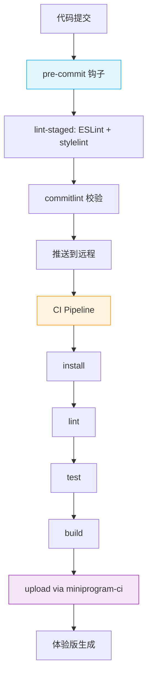

# 工程化

本章节记录小程序项目的工程化流程，包括代码规范检查、CI/CD、测试等。

## 子文档

- [Lint](./lint/) - ESLint、stylelint 代码规范检查
- [CI/CD](./ci/) - 基于 miniprogram-ci 的自动化构建与上传
- [测试](./testing/) - 单元测试、组件测试（miniprogram-simulate）、E2E（miniprogram-automator）

## 工具栈

| 环节 | 工具 |
|------|------|
| 代码规范 | ESLint + stylelint |
| 单元测试 | Jest + [miniprogram-simulate](https://github.com/wechat-miniprogram/miniprogram-simulate) |
| 组件测试 | miniprogram-simulate |
| E2E 测试 | [miniprogram-automator](https://developers.weixin.qq.com/miniprogram/dev/devtools/auto/) |
| CI 构建 | 微信开发者工具 CLI / miniprogram-ci |
| 质量检查 | Qodana（仅分析 JS/TS） |
| 性能监控 | 小程序性能面板 / 自定义埋点 |

## 流程总览

