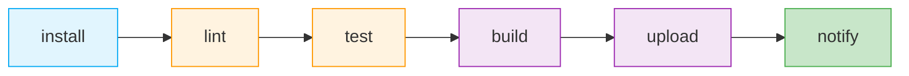

# CI/CD

本项目使用 **GitLab CI/CD** 或 **GitHub Actions** 自动化构建、测试、质量检查和上传流程。本文档以 GitLab CI 为例，GitHub Actions 配置类似。

## Pipeline 总览

整个 Pipeline 由 **6 个阶段**顺序执行：



阶段的顺序是刻意设计的：越早的阶段越轻量，发现问题的成本越低。

## 各阶段说明

### 1. install — 安装依赖

| Job | 说明 |
|-----|------|
| `setup` | 使用 `npm ci` 安装项目依赖，并将 `~/.npm` 和 `node_modules/` 写入缓存 |

```yaml
# .gitlab-ci.yml
install:
  stage: install
  image: node:18
  cache:
    key: ${CI_COMMIT_REF_SLUG}
    paths:
      - node_modules/
      - .npm/
  script:
    - npm ci --cache .npm --prefer-offline
  artifacts:
    paths:
      - node_modules/
```

### 2. lint — 代码规范检查

| Job | 工具 | 说明 |
|-----|------|------|
| `eslint` | ESLint（Airbnb 规范） | 检查 JavaScript / TypeScript 代码规范 |
| `stylelint` | stylelint（twbs-bootstrap 规范） | 检查 WXSS / SCSS 样式代码规范 |

```yaml
lint:
  stage: lint
  image: node:18
  script:
    - npm run lint
    - npm run lint:style
```

lint 失败时 Pipeline 中止，不会进入后续阶段。

:::tip
Lint 规范与提交前的 husky + lint-staged 钩子保持一致，本地提交和 CI 两道关卡用同一套规则。
:::

### 3. test — 测试

| Job | 工具 | 触发条件 |
|-----|------|---------|
| `unit tests` | Jest + miniprogram-simulate | 每次 Pipeline |
| `coverage` | Jest（coverage 模式） | MR 和默认分支 |

```yaml
test:
  stage: test
  image: node:18
  script:
    - npm run test
  coverage: '/Lines\s*:\s*(\d+\.\d+)%/'
  artifacts:
    reports:
      coverage_report:
        coverage_format: cobertura
        path: coverage/cobertura-coverage.xml
```

详见 [测试](../testing/).

### 4. build — 构建

| Job | 说明 |
|-----|------|
| `build` | 通过微信开发者工具 CLI 构建 npm，产物输出到 `miniprogram_npm/` |

```yaml
build:
  stage: build
  image: node:18
  script:
    # 构建小程序 npm
    - npm run build:npm
  artifacts:
    paths:
      - miniprogram_npm/
      - dist/
```

:::warning
小程序的"构建 npm"是将 `node_modules` 中的包构建到 `miniprogram_npm/` 目录，与 Web 的打包构建不同。详见 [npm 支持](https://developers.weixin.qq.com/miniprogram/dev/devtools/npm.html)。
:::

### 5. upload — 上传

使用 [miniprogram-ci](https://github.com/wechat-miniprogram/miniprogram-ci) 上传代码到微信服务器。

```yaml
upload:
  stage: upload
  image: node:18
  rules:
    - if: $CI_COMMIT_BRANCH == "develop"
      variables:
        ENV: "test"
        VERSION: "体验版"
    - if: $CI_COMMIT_BRANCH == "main"
      variables:
        ENV: "prod"
        VERSION: "正式版"
  script:
    - node scripts/upload.js --env=$ENV --version="$VERSION"
```

#### 上传脚本

```js
// scripts/upload.js
const ci = require('miniprogram-ci');
const path = require('path');

const args = process.argv.slice(2);
const envArg = args.find((a) => a.startsWith('--env='));
const versionArg = args.find((a) => a.startsWith('--version='));

const env = envArg?.split('=')[1] || 'test';
const version = versionArg?.split('=')[1] || '体验版';

const project = new ci.Project({
  appid: process.env.WX_APPID,
  type: 'miniProgram',
  projectPath: path.resolve(__dirname, '../'),
  privateKeyPath: path.resolve(__dirname, `../cert/private.${env}.key`),
  ignores: ['node_modules/**/*'],
});

(async () => {
  try {
    const uploadResult = await ci.upload({
      project,
      version: require('../package.json').version,
      desc: `${version} - ${new Date().toLocaleString()}`,
      setting: {
        es6: true,
        es7: true,
        minify: true,
        autoPrefixWXSS: true,
      },
      onProgressUpdate: console.log,
    });

    console.log('上传成功', uploadResult);
  } catch (error) {
    console.error('上传失败', error);
    process.exit(1);
  }
})();
```

#### CI 密钥配置

:::warning[安全]
`private.*.key` 是小程序上传密钥，**严禁提交到代码仓库**。在 CI 中通过环境变量或密钥管理服务注入：

```yaml
upload:
  before_script:
    # 从 CI 变量写入密钥文件
    - echo "$WX_PRIVATE_KEY" > cert/private.$ENV.key
```
:::

### 6. notify — 通知

```yaml
notify:
  stage: notify
  script:
    - echo "Pipeline 完成"
  after_script:
    - |
      if [ $CI_PIPELINE_STATUS = "success" ]; then
        curl -X POST "https://qyapi.weixin.qq.com/cgi-bin/webhook/send?key=$WECOM_BOT_KEY" \
          -H "Content-Type: application/json" \
          -d "{\"msgtype\":\"markdown\",\"markdown\":{\"content\":\"✅ 小程序上传成功\n> 分支: $CI_COMMIT_BRANCH\n> 版本: $VERSION\"}}"
      fi
```

## 完整 .gitlab-ci.yml

```yaml
stages:
  - install
  - lint
  - test
  - build
  - upload
  - notify

variables:
  NODE_ENV: production

install:
  stage: install
  image: node:18
  cache:
    key: ${CI_COMMIT_REF_SLUG}
    paths:
      - node_modules/
  script:
    - npm ci
  artifacts:
    paths:
      - node_modules/

lint:
  stage: lint
  image: node:18
  needs: [install]
  script:
    - npm run lint
    - npm run lint:style

test:
  stage: test
  image: node:18
  needs: [install]
  script:
    - npm run test
  coverage: '/Lines\s*:\s*(\d+\.\d+)%/'
  artifacts:
    reports:
      coverage_report:
        coverage_format: cobertura
        path: coverage/cobertura-coverage.xml

build:
  stage: build
  image: node:18
  needs: [install]
  script:
    - npm run build:npm
  artifacts:
    paths:
      - miniprogram_npm/

upload:develop:
  stage: upload
  image: node:18
  needs: [lint, test, build]
  rules:
    - if: $CI_COMMIT_BRANCH == "develop"
  before_script:
    - echo "$WX_PRIVATE_KEY_TEST" > cert/private.test.key
  script:
    - node scripts/upload.js --env=test --version="体验版"

upload:main:
  stage: upload
  image: node:18
  needs: [lint, test, build]
  rules:
    - if: $CI_COMMIT_BRANCH == "main"
  before_script:
    - echo "$WX_PRIVATE_KEY_PROD" > cert/private.prod.key
  script:
    - node scripts/upload.js --env=prod --version="正式版"

notify:
  stage: notify
  needs: [upload:develop, upload:main]
  rules:
    - if: $CI_COMMIT_BRANCH == "develop" || $CI_COMMIT_BRANCH == "main"
  script:
    - echo "通知完成"
```

## 体验版与正式版

| 版本 | 触发分支 | 用途 | 上传后操作 |
|------|---------|------|----------|
| 体验版 | `develop` | 内部测试 | 自动生成体验版二维码 |
| 正式版 | `main` | 用户发布 | 需在微信后台提交审核 |

:::tip
正式版上传后不会自动发布，需在微信公众平台 → 版本管理 → 提交审核，审核通过后手动发布。
:::

## 本地部署

不使用 CI 时，也可在本地通过 `miniprogram-ci` 手动构建和上传。

### 命令行配置

```json
{
  "scripts": {
    "build": "node scripts/build.js",
    "deploy": "node scripts/deploy.js"
  },
  "devDependencies": {
    "miniprogram-ci": "^1.8.35"
  }
}
```

```bash
# 构建 npm
npm run build

# 上传代码
npm run deploy
```

### 构建 npm

```js
// scripts/build.js
const path = require('path');
const ci = require('miniprogram-ci');

(async () => {
  const packResult = await ci.packNpmManually({
    packageJsonPath: path.join(__dirname, '../package.json'),
    miniprogramNpmDistDir: path.join(__dirname, '../src/'),
    ignores: [],
  });

  console.log('pack done, packResult:', packResult);
})();
```

### 上传代码

```js
// scripts/deploy.js
const path = require('path');
const ci = require('miniprogram-ci');

(async () => {
  const project = new ci.Project({
    appid: '<YOUR_APPID>',
    projectPath: path.join(__dirname, '../'),
    privateKeyPath: '<YOUR_PROJECT_KEY>',
    type: 'miniProgram',
    ignores: ['node_modules/**/*'],
  });

  const uploadResult = await ci.upload({
    project,
    version: '<VERSION>',
    desc: '修复了一些已知问题',
    setting: {
      es6: true,
      es7: true,
      disableUseStrict: false,
      minify: true,
      codeProtect: true,
      autoPrefixWXSS: true,
    },
    onProgressUpdate: console.log,
  });

  console.log(uploadResult);
})();
```

:::tip
上传密钥可以在 "[微信公众平台](https://mp.weixin.qq.com/) - 开发 - 开发设置" 获取，并建议设置上传白名单 IP。
:::

## 参考资料

- [miniprogram-ci](https://developers.weixin.qq.com/miniprogram/dev/devtools/ci.html)
- [GitLab CI/CD](https://docs.gitlab.com/ee/ci/)
- [GitHub Actions](https://docs.github.com/zh/actions)
