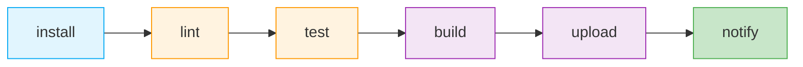

# CI/CD

本项目使用 **GitLab CI/CD** 自动化构建、测试、质量检查和上传流程。

## Pipeline 总览

整个 Pipeline 由 **6 个阶段**顺序执行：



阶段的顺序是刻意设计的：越早的阶段越轻量，发现问题的成本越低。

## 各阶段说明

### 1. install — 安装依赖

| Job | 说明 |
|-----|------|
| `setup` | 使用 `npm ci` 安装项目依赖，并将 `~/.npm` 和 `node_modules/` 写入缓存 |

```yaml
# .gitlab-ci.yml
install:
  stage: install
  image: node:lts
  cache:
    key: ${CI_COMMIT_REF_SLUG}
    paths:
      - node_modules/
      - .npm/
  script:
    - npm ci --cache .npm --prefer-offline
  artifacts:
    paths:
      - node_modules/
```

### 2. lint — 代码规范检查

| Job | 工具 | 说明 |
|-----|------|------|
| `eslint` | ESLint（Airbnb 规范） | 检查 JavaScript / TypeScript 代码规范 |
| `stylelint` | stylelint（twbs-bootstrap 规范） | 检查 WXSS / SCSS 样式代码规范 |

```yaml
lint:
  stage: lint
  image: node:lts
  script:
    - npm run lint
    - npm run lint:style
```

lint 失败时 Pipeline 中止，不会进入后续阶段。

:::tip
Lint 规范与提交前的 husky + lint-staged 钩子保持一致，本地提交和 CI 两道关卡用同一套规则。
:::

### 3. test — 测试

| Job | 工具 | 触发条件 |
|-----|------|---------|
| `unit tests` | Jest + miniprogram-simulate | 每次 Pipeline |
| `coverage` | Jest（coverage 模式） | MR 和默认分支 |

```yaml
test:
  stage: test
  image: node:lts
  script:
    - npm run test
  coverage: '/Lines\s*:\s*(\d+\.\d+)%/'
  artifacts:
    reports:
      coverage_report:
        coverage_format: cobertura
        path: coverage/cobertura-coverage.xml
```

详见 [测试](../testing/).

### 4. build — 构建

| Job | 说明 |
|-----|------|
| `build` | 通过微信开发者工具 CLI 构建 npm，产物输出到 `miniprogram_npm/` |

```yaml
build:
  stage: build
  image: node:lts
  script:
    # 构建小程序 npm
    - npm run build:npm
  artifacts:
    paths:
      - miniprogram_npm/
      - dist/
```

:::warning
小程序的"构建 npm"是将 `node_modules` 中的包构建到 `miniprogram_npm/` 目录，与 Web 的打包构建不同。详见 [npm 支持](https://developers.weixin.qq.com/miniprogram/dev/devtools/npm.html)。
:::

### 5. upload — 上传

使用 [miniprogram-ci](https://www.npmjs.com/package/miniprogram-ci) 上传代码到微信服务器。

```yaml
upload:
  stage: upload
  image: node:lts
  rules:
    - if: $CI_COMMIT_BRANCH == "develop"
      variables:
        VERSION: "体验版"
    - if: $CI_COMMIT_BRANCH == "main"
      variables:
        VERSION: "正式版"
  script:
    - node scripts/upload.mjs --version="$VERSION"
```

#### 上传脚本

```js
// scripts/upload.mjs
import ci from 'miniprogram-ci';
import path from 'node:path';
import fs from 'node:fs';
import { fileURLToPath } from 'node:url';

const __dirname = path.dirname(fileURLToPath(import.meta.url));

const args = process.argv.slice(2);
const versionArg = args.find((a) => a.startsWith('--version='));
const version = versionArg?.split('=')[1] || '体验版';

const { version: pkgVersion } = JSON.parse(
  fs.readFileSync(path.resolve(__dirname, '../package.json'), 'utf-8'),
);

const project = new ci.Project({
  appid: process.env.WX_APPID,
  type: 'miniProgram',
  projectPath: path.resolve(__dirname, '../'),
  privateKey: process.env.WX_PRIVATE_KEY,
  ignores: ['node_modules/**/*'],
});

try {
  const uploadResult = await ci.upload({
    project,
    version: pkgVersion,
    desc: `${version} - ${new Date().toLocaleString()}`,
    setting: {
      es6: true,
      es7: true,
      minify: true,
      autoPrefixWXSS: true,
    },
    onProgressUpdate: console.log,
  });

  console.log('上传成功', uploadResult);
} catch (error) {
  console.error('上传失败', error);
  process.exit(1);
}
```

:::tip
脚本使用 ESM 语法，文件后缀为 `.mjs`，无需在 `package.json` 中设置 `"type": "module"`（避免影响小程序运行时的 CommonJS 模块解析）。Node LTS 原生支持 ESM 与顶层 `await`。
:::

#### CI 密钥配置

上传脚本中的 `WX_APPID` 与 `WX_PRIVATE_KEY` 均来自 GitLab CI/CD 变量（Settings → CI/CD → Variables），无需在脚本中硬编码，也无需将密钥写入文件：

| 变量 | 说明 | 掩码/保护 |
|------|------|----------|
| `WX_APPID` | 小程序 AppID | 可不掩码 |
| `WX_PRIVATE_KEY` | 上传密钥的**完整内容**（从微信公众平台下载的 `.key` 文件内容） | 掩码 + 仅保护分支 |

脚本通过 `privateKey: process.env.WX_PRIVATE_KEY` 直接将密钥内容传给 `miniprogram-ci`，无需 `privateKeyPath`，也不必在 CI 中 `echo` 写盘。

:::warning[安全]
上传密钥拥有预览、上传代码的权限，**严禁提交到代码仓库**。务必在 GitLab 中将 `WX_PRIVATE_KEY` 标记为 **Masked**，并限制仅在 `develop`/`main` 分支可用（Protected）。同时建议在微信公众平台配置上传白名单 IP（CI Runner 出口 IP）。
:::

### 6. notify — 通知

```yaml
notify:
  stage: notify
  script:
    - echo "Pipeline 完成"
  after_script:
    - |
      if [ $CI_PIPELINE_STATUS = "success" ]; then
        curl -X POST "https://qyapi.weixin.qq.com/cgi-bin/webhook/send?key=$WECOM_BOT_KEY" \
          -H "Content-Type: application/json" \
          -d "{\"msgtype\":\"markdown\",\"markdown\":{\"content\":\"✅ 小程序上传成功\n> 分支: $CI_COMMIT_BRANCH\n> 版本: $VERSION\"}}"
      fi
```

## 完整 .gitlab-ci.yml

```yaml
stages:
  - install
  - lint
  - test
  - build
  - upload
  - notify

variables:
  NODE_ENV: production

install:
  stage: install
  image: node:lts
  cache:
    key: ${CI_COMMIT_REF_SLUG}
    paths:
      - node_modules/
  script:
    - npm ci
  artifacts:
    paths:
      - node_modules/

lint:
  stage: lint
  image: node:lts
  needs: [install]
  script:
    - npm run lint
    - npm run lint:style

test:
  stage: test
  image: node:lts
  needs: [install]
  script:
    - npm run test
  coverage: '/Lines\s*:\s*(\d+\.\d+)%/'
  artifacts:
    reports:
      coverage_report:
        coverage_format: cobertura
        path: coverage/cobertura-coverage.xml

build:
  stage: build
  image: node:lts
  needs: [install]
  script:
    - npm run build:npm
  artifacts:
    paths:
      - miniprogram_npm/

upload:develop:
  stage: upload
  image: node:lts
  needs: [lint, test, build]
  rules:
    - if: $CI_COMMIT_BRANCH == "develop"
  script:
    - node scripts/upload.mjs --version="体验版"

upload:main:
  stage: upload
  image: node:lts
  needs: [lint, test, build]
  rules:
    - if: $CI_COMMIT_BRANCH == "main"
  script:
    - node scripts/upload.mjs --version="正式版"

notify:
  stage: notify
  needs: [upload:develop, upload:main]
  rules:
    - if: $CI_COMMIT_BRANCH == "develop" || $CI_COMMIT_BRANCH == "main"
  script:
    - echo "通知完成"
```

## 体验版与正式版

| 版本 | 触发分支 | 用途 | 上传后操作 |
|------|---------|------|----------|
| 体验版 | `develop` | 内部测试 | 自动生成体验版二维码 |
| 正式版 | `main` | 用户发布 | 需在微信后台提交审核 |

:::tip
正式版上传后不会自动发布，需在微信公众平台 → 版本管理 → 提交审核，审核通过后手动发布。
:::

## 参考资料

- [miniprogram-ci](https://developers.weixin.qq.com/miniprogram/dev/devtools/ci.html)
- [GitLab CI/CD](https://docs.gitlab.com/ee/ci/)
