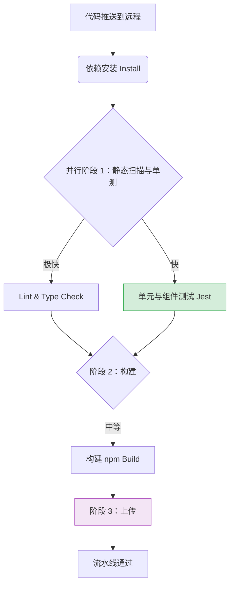

# 测试

测试是前端工程化中的重要环节，有助于提高代码质量、减少 bug 出现率，并确保应用在各种场景下都能稳定运行。

## 测试工具栈

| 测试环节 | 工具 | 定位说明 |
|---------|------|---------|
| 单元测试 | [Jest](https://jestjs.io/zh-Hans/) | 极速反馈层：纯逻辑、工具函数 |
| 组件测试 | [miniprogram-simulate](https://github.com/wechat-miniprogram/miniprogram-simulate) | UI 交互层：组件渲染与用户行为 |
| Mock 数据 | [Faker.js](https://fakerjs.dev/) | 数据生成层：生成随机测试数据 |
| E2E 测试 | [miniprogram-automator](https://developers.weixin.qq.com/miniprogram/dev/devtools/auto/) | 系统验证层：真实用户场景模拟 |

## 测试金字塔

```
        /\
       /E2E\         少量，慢，真实
      /------\
     /组件测试 \      中等，关注组件行为
    /----------\
   /  单元测试   \    大量，快，纯逻辑
  /______________\
```

- **单元测试**：覆盖 `utils/`、`services/` 中的纯函数，性价比最高
- **组件测试**：覆盖自定义组件的渲染、properties、事件
- **E2E 测试**：覆盖核心业务流程（登录、支付、下单），少量但关键

## 阶段一：本地开发测试流

### 1. 静态分析拦截

在编写任何逻辑和测试之前，静态分析作为最底层的防线开始工作。通过编辑器实时校验，以及配合 ESLint / stylelint 检查拼写、语法和代码风格。

### 2. 纯函数单元测试

`utils` 和 `services` 中的纯函数应优先编写单元测试：

```ts
// services/crypto/mask.ts
export const maskPhone = (phone: string): string => {
  if (!phone || phone.length !== 11) return phone;
  return phone.replace(/(\d{3})\d{4}(\d{4})/, '$1****$2');
};
```

```ts
// __tests__/services/crypto/mask.test.ts
import { maskPhone } from '@/services/crypto/mask';

describe('maskPhone', () => {
  it('应正确脱敏 11 位手机号', () => {
    expect(maskPhone('13800138000')).toBe('138****8000');
  });

  it('非 11 位手机号原样返回', () => {
    expect(maskPhone('1380013800')).toBe('1380013800');
    expect(maskPhone('')).toBe('');
  });
});
```

### 3. 组件测试（miniprogram-simulate）

#### 是什么

[miniprogram-simulate](https://github.com/wechat-miniprogram/miniprogram-simulate) 是微信官方提供的小程序组件测试工具，可以在 Node 环境中**模拟小程序组件的渲染、生命周期和事件**，无需启动开发者工具即可运行测试。

#### 适合做什么 / 不适合做什么

**✅ 适合**

- 测试自定义组件的渲染输出（DOM 树、data 字段）
- 测试组件 properties 变化后的响应
- 测试组件方法（methods）的纯逻辑
- 测试组件间 `triggerEvent` 的事件传递
- CI 中跑组件级回归测试

**❌ 不适合**

- 测试 `wx.*` 平台 API 的真实行为（如真实网络请求、真实存储）
- 测试页面跳转、tabBar 等页面级交互
- 测试真机性能

这些场景交给 [miniprogram-automator](#阶段四e2e-自动化测试miniprogram-automator) E2E 测试。

#### 工作原理

`miniprogram-simulate` 在 Node 中用 jsdom 模拟 DOM，加载并渲染小程序组件，提供：

- `simulate.load()`：加载组件，返回 componentId
- `simulate.render()`：渲染组件，返回组件实例
- 实例可访问 `data`、`instance`（组件 this）、`querySelector`（子节点）

它**不会真的调用 `wx.*`**——`wx` 全局对象需要测试用例自己 mock（见下文「Mock wx API」部分）。

#### 安装

```bash
npm install -D miniprogram-simulate jest jsdom
```

#### Jest 配置

```js
// jest.config.js
module.exports = {
  testEnvironment: 'jsdom',
  testMatch: ['**/__tests__/**/*.test.ts'],
  moduleNameMapper: {
    '^@/(.*)$': '<rootDir>/src/$1',
  },
  transform: {
    '^.+\\.ts$': 'ts-jest',
  },
  setupFiles: ['<rootDir>/jest.setup.js'],
};
```

```js
// jest.setup.js
// 模拟小程序全局 API（按需补充）
global.wx = {
  // 大多数组件测试不需要 wx API，按用例补充
};
```

#### 基础示例

被测组件：

```ts
// src/components/counter/counter.ts
Component({
  data: { count: 0 },
  methods: {
    onIncrement() {
      this.setData({ count: this.data.count + 1 });
    },
  },
});
```

测试用例：

```ts
// __tests__/components/counter.test.ts
const simulate = require('miniprogram-simulate');
const path = require('path');

describe('counter 组件', () => {
  let componentId: string;

  beforeAll(() => {
    componentId = simulate.load(path.resolve(__dirname, '../../src/components/counter/counter'));
  });

  it('初始 count 应为 0', () => {
    const comp = simulate.render(componentId);
    comp.attach(document.body);
    expect(comp.data.count).toBe(0);
  });

  it('点击后 count 应 +1', () => {
    const comp = simulate.render(componentId);
    comp.attach(document.body);

    comp.instance.onIncrement();
    expect(comp.data.count).toBe(1);
  });
});
```

#### 测试 properties 与 events

被测组件：

```ts
// src/components/stepper/stepper.ts
Component({
  properties: {
    min: { type: Number, value: 0 },
    max: { type: Number, value: 10 },
    value: { type: Number, value: 0 },
  },
  methods: {
    onDec() {
      const next = Math.max(this.properties.min, this.properties.value - 1);
      this.setData({ value: next });
      this.triggerEvent('change', { value: next });
    },
  },
});
```

测试用例：

```ts
describe('stepper 组件', () => {
  let id: string;
  beforeAll(() => {
    id = simulate.load(path.resolve(__dirname, '../../src/components/stepper/stepper'));
  });

  it('受 min 约束', () => {
    const comp = simulate.render(id, { min: 0, value: 0 });
    comp.attach(document.body);
    comp.instance.onDec();
    expect(comp.data.value).toBe(0);
  });

  it('change 事件携带新值', () => {
    const comp = simulate.render(id, { min: 0, max: 10, value: 5 });
    comp.attach(document.body);

    const onChange = jest.fn();
    comp.addEventListener('change', onChange);

    comp.instance.onDec();
    expect(onChange).toHaveBeenCalledWith(expect.objectContaining({
      detail: { value: 4 },
    }));
  });
});
```

#### Mock wx API

`miniprogram-simulate` 不会调用真实 `wx`。如果组件方法依赖 `wx.showToast` 等，需要在用例中 mock：

```ts
// jest.setup.js
global.wx = {
  showToast: jest.fn(),
  showLoading: jest.fn(),
  hideLoading: jest.fn(),
};
```

```ts
// __tests__/components/feedback.test.ts
beforeEach(() => {
  jest.clearAllMocks();
});

it('提交成功应弹 toast', () => {
  const comp = simulate.render(id);
  comp.attach(document.body);

  comp.instance.onSubmitSuccess();
  expect(global.wx.showToast).toHaveBeenCalledWith(
    expect.objectContaining({ title: '提交成功' })
  );
});
```

如果被测代码通过 services 间接调用 wx（如 `services/auth/login.ts` 调用 `wx.login`），见下文「Mock wx API（services 层）」部分。

#### 组件测试常见问题

**Q: 报错 `Cannot find module 'xxx'`**

被测组件依赖了 npm 包但没构建。先在开发者工具或 CI 跑"构建 npm"，确保 `miniprogram_npm/` 存在。

**Q: 测试中 `comp.instance.xxx` 是 undefined**

`instance` 上只能访问 `methods` 中的方法，不能直接访问 data 字段（用 `comp.data.xxx`）。

**Q: 子组件渲染不出来**

miniprogram-simulate 默认会加载被测组件引用的子组件。如果子组件依赖 npm 包，需在 jest 配置 `moduleNameMapper`。

### 4. Mock wx API（services 层）

在测试 services 层时同样需要 Mock 小程序 API，避免真实调用：

```ts
// __tests__/services/auth/login.test.ts
import { login } from '@/services/auth/login';

// Mock wx.login
const mockWxLogin = jest.fn();
global.wx = {
  login: mockWxLogin,
  setStorageSync: jest.fn(),
  getStorageSync: jest.fn(),
};

describe('login', () => {
  beforeEach(() => {
    jest.clearAllMocks();
  });

  it('应正确处理登录流程', async () => {
    mockWxLogin.mockImplementation(({ success }) => {
      success({ code: 'test_code' });
    });

    // Mock request
    jest.mock('@/services/http', () => ({
      request: jest.fn().mockResolvedValue({
        token: 'test_token',
        refreshToken: 'test_refresh_token',
        isNewUser: false,
      }),
    }));

    const result = await login();

    expect(result.token).toBe('test_token');
    expect(global.wx.setStorageSync).toHaveBeenCalledWith(
      'auth_token',
      expect.objectContaining({ data: 'test_token' }),
    );
  });
});
```

## 阶段二：代码提交管控流

通过 Husky + lint-staged 在本地提交时设置卡点：

- **Lint 校验**：对暂存区代码运行 ESLint
- **相关性测试运行**：自动运行受当前提交文件影响的单元测试（Jest 的 `--findRelatedTests`）
- **卡点规则**：仅当上述静态分析和受影响的单测全部通过时，才允许生成 commit

```json
// package.json
{
  "lint-staged": {
    "*.{js,ts}": ["eslint --fix", "jest --findRelatedTests"]
  }
}
```

## 阶段三：CI/CD 持续集成流水线



### 1. 并行质量门禁

- **静态检查 & 类型检查**：全局运行 ESLint 及 TypeScript `tsc --noEmit`
- **单元测试/组件测试**：执行全量的 Jest 测试套件
- **覆盖率检查**：收集代码覆盖率，低于阈值（如 70%）流水线阻断

### 2. 构建打包

执行 `npm run build:npm` 构建 `miniprogram_npm/`。

### 3. 上传

通过 `miniprogram-ci` 上传到微信服务器，详见 [CI/CD](../ci/).

## 阶段四：E2E 自动化测试（miniprogram-automator）

### 是什么

[miniprogram-automator](https://developers.weixin.qq.com/miniprogram/dev/devtools/auto/) 是微信官方的小程序端到端（E2E）自动化测试工具。它通过外部控制**微信开发者工具**，模拟用户操作（点击、输入、滚动），验证完整业务链路。

### 与 miniprogram-simulate 的区别

| 对比项 | miniprogram-simulate | miniprogram-automator |
|--------|---------------------|------------------------|
| 运行环境 | Node + jsdom | 微信开发者工具 |
| 测试粒度 | 组件 / 函数 | 完整页面 / 完整业务流程 |
| 是否真实渲染 | ❌ 模拟 | ✅ 真实渲染 |
| 是否调用 wx API | ❌ 需 mock | ✅ 真实调用 |
| 速度 | 快（毫秒级） | 慢（秒级，需启动工具） |
| 适合场景 | 组件单元测试 | 登录流程、支付流程等端到端验证 |

定位互补：simulate 跑大量组件用例，automator 跑少量关键路径用例。

### 环境要求

- 已安装微信开发者工具
- 开发者工具 → 设置 → 安全设置 → 开启"服务端口"
- 操作系统：macOS / Windows（**Linux 不支持**，因开发者工具不支持）

### 安装

```bash
npm install -D miniprogram-automator
```

### 基础示例

```ts
// e2e/login.test.ts
const automator = require('miniprogram-automator');

describe('登录流程 E2E', () => {
  let miniProgram: any;
  let page: any;

  beforeAll(async () => {
    miniProgram = await automator.launch({
      cliPath: '/Applications/wechatwebdevtools.app/Contents/MacOS/cli',  // macOS
      // Windows: 'C:\\Program Files (x86)\\Tencent\\微信web开发者工具\\cli.bat'
      projectPath: '/path/to/your/miniprogram',
    });
  });

  afterAll(async () => {
    await miniProgram.close();
  });

  beforeEach(async () => {
    page = await miniProgram.reLaunch('/pages/login/login');
    await page.waitFor(500);
  });

  it('点击登录按钮应跳转到首页', async () => {
    const loginBtn = await page.$('.login-btn');
    await loginBtn.tap();

    await page.waitFor(1000);
    const currentPage = await miniProgram.currentPage();
    expect(currentPage.path).toBe('pages/home/home');
  });
});
```

### 核心 API

| API | 作用 |
|-----|------|
| `automator.launch(opts)` | 启动开发者工具并连接，返回 miniProgram 实例 |
| `miniProgram.reLaunch(path)` | 跳转到指定页面 |
| `miniProgram.currentPage()` | 获取当前页面对象 |
| `miniProgram.callMethod(name, args)` | 调用页面方法（用于触发登录、提交等） |
| `miniProgram.mockWxMethod(name, fn)` | mock `wx.*` API（如 mock wx.request） |
| `page.$(selector)` / `page.$$(selector)` | 查找元素 / 元素列表 |
| `element.tap()` / `element.input(value)` | 模拟点击 / 输入 |
| `page.waitFor(ms)` / `page.waitFor(condition)` | 等待时间 / 条件 |
| `miniProgram.close()` | 关闭连接 |

### Mock 网络（关键能力）

E2E 测试通常会 mock `wx.request`，避免依赖真实后端：

```ts
beforeAll(async () => {
  miniProgram = await automator.launch({ /* ... */ });

  // mock wx.request
  await miniProgram.mockWxMethod('request', (options, invokeCallback) => {
    if (options.url.includes('/api/auth/login')) {
      invokeCallback({
        statusCode: 200,
        data: { token: 'mock_token', refreshToken: 'mock_refresh' },
      });
    } else {
      invokeCallback({ statusCode: 404 });
    }
  });
});
```

这样在 E2E 中跑完整登录 → 支付链路，但**不依赖真实后端**，保证测试稳定。

### 真实场景示例：完整下单流程

```ts
describe('下单流程 E2E', () => {
  let miniProgram: any;

  beforeAll(async () => {
    miniProgram = await automator.launch({
      cliPath: process.env.WX_CLI_PATH,
      projectPath: process.env.WX_PROJECT_PATH,
    });

    // 预置登录态：mock wx.login + wx.request
    await miniProgram.mockWxMethod('login', (options, invokeCallback) => {
      invokeCallback({ code: 'mock_code' });
    });
    await miniProgram.mockWxMethod('request', (options, invokeCallback) => {
      // 按 URL 路由返回不同 mock 数据
      // ...
    });
  });

  it('从首页到下单成功全链路', async () => {
    await miniProgram.reLaunch('/pages/home/home');

    // 1. 点击第一个商品
    const item = await miniProgram.$('.goods-item');
    await item.tap();

    // 2. 详情页加入购物车
    await miniProgram.waitFor(800);
    const addBtn = await miniProgram.$('.add-to-cart');
    await addBtn.tap();

    // 3. 跳到购物车
    await miniProgram.navigateTo({ url: '/pages/cart/cart' });
    await miniProgram.waitFor(500);

    // 4. 结算
    const checkoutBtn = await miniProgram.$('.checkout-btn');
    await checkoutBtn.tap();

    // 5. 验证跳转到订单页
    await miniProgram.waitFor(1500);
    const current = await miniProgram.currentPage();
    expect(current.path).toBe('pages/order/order');
  });

  afterAll(async () => {
    await miniProgram.close();
  });
});
```

### CI 集成

:::warning
E2E 测试依赖微信开发者工具，CI 机器需预装。目前仅 macOS / Windows 支持。
:::

GitHub Actions 示例：

```yaml
# .github/workflows/e2e.yml
name: E2E
on: [push]
jobs:
  e2e:
    runs-on: macos-latest    # 必须用 macos 或 windows
    steps:
      - uses: actions/checkout@v3
      - uses: actions/setup-node@v3
        with:
          node-version: 18

      - name: 安装微信开发者工具
        run: |
          brew install --cask wechatwebdevtools
          # 启动并打开服务端口
          /Applications/wechatwebdevtools.app/Contents/MacOS/cli open --project $PWD

      - name: 等待工具启动
        run: sleep 30

      - name: 跑 E2E
        env:
          WX_CLI_PATH: /Applications/wechatwebdevtools.app/Contents/MacOS/cli
          WX_PROJECT_PATH: ${{ github.workspace }}
        run: npm run test:e2e
```

### 何时用 / 何时不用

**✅ 推荐**

- 核心业务路径（登录、下单、支付）的回归保护
- 频繁改动但风险高的页面
- 替代重复的人工冒烟测试

**❌ 不推荐**

- 大量细节断言（用 miniprogram-simulate 跑组件级更高效）
- CI 时长紧张时全量 E2E（耗时大）
- Linux CI 机器（不支持）

### 限制

- 启动慢（每次启动开发者工具 + 项目编译需数秒~数十秒）
- 用例间状态隔离需自行管理（每次测试前 `reLaunch` 重置）
- 不支持 Linux
- 开发者工具版本与 SDK 兼容性偶有抖动，需固定版本

## 策略与权衡

- **避免过度测试**：100% 的代码覆盖率不是目标。如果项目是重度 UI 展现且业务逻辑简单，应将资源倾斜到 E2E 阶段
- **关注 CI 耗时**：如果 CI 流水线运行时间过长，应审视是否将过多本应由组件测试承担的断言逻辑，写到了笨重的 E2E 中
- **优先测试纯函数**：`utils`、`services` 中的业务逻辑应优先覆盖单元测试，性价比最高

## 测试覆盖率配置

```js
// jest.config.js
module.exports = {
  collectCoverage: true,
  coverageDirectory: 'coverage',
  coverageReporters: ['text', 'lcov', 'cobertura'],
  coverageThreshold: {
    global: {
      branches: 70,
      functions: 70,
      lines: 70,
      statements: 70,
    },
  },
  collectCoverageFrom: [
    'src/**/*.ts',
    '!src/**/*.d.ts',
    '!src/miniprogram_npm/**',
  ],
};
```

## 参考资料

- [miniprogram-simulate](https://github.com/wechat-miniprogram/miniprogram-simulate)
- [miniprogram-automator](https://developers.weixin.qq.com/miniprogram/dev/devtools/auto/)
- [Jest](https://jestjs.io/zh-Hans/)
- [小程序自动化测试](https://developers.weixin.qq.com/miniprogram/dev/framework/custom-component/unit-test.html)
