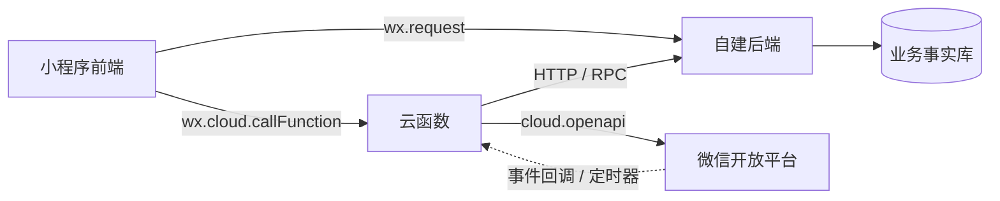

# 云函数

## 1. 核心概念与定位

云函数（Cloud Functions）是微信云开发（CloudBase）提供的 Serverless 无服务计算能力。开发者可编写 Node.js（或 Python/PHP）代码并部署在微信托管的云端环境中。微信自动处理底层运行环境搭建与平滑扩缩容。

在小程序端，通过 `wx.cloud.callFunction` 即可发起调用。其核心优势在于：**函数环境内集成了免鉴权的微信开放能力**（通过 `cloud.openapi.*`），开发者无需自行维护 access_token 的获取、缓存与刷新机制。

**架构定位**：云函数与“自建后端”并非完全对等的替代品。在复杂业务场景中，云函数更多扮演的是**“微信侧网关适配层”**的角色。

### 混用方案数据流

在推荐的混用架构下，云函数**仅负责微信侧生态能力的适配**（如调用微信开放接口、接收微信事件回调、执行云端定时任务等）。核心的业务数据流、用户鉴权体系仍由自建后端承担，确保业务数据库与用户资产不分裂。



## 2. 架构能力对比：云函数 vs 自建后端

| 评估维度 | 云函数 (Serverless) | 自建后端 (Java/Node/Go + 容器/服务器) |
|---------|-------------------|-------------------------------------|
| 底层运维 | 零运维，微信自动托管与扩缩容 | 需自行负责部署、监控、负载均衡及扩容 |
| Token 管理 | 框架原生免鉴权注入 | 需自行实现获取、刷新、并发防并发刷新缓存 |
| 开放接口调用 | `cloud.openapi.*` 内部网络直连 | 需处理外部网络请求与繁杂的签名校验 |
| 数据与存储 | 强绑定配套云数据库 (NoSQL) 及云存储 | 自由选型 (MySQL/PG/Redis/OSS 等) |
| 启动性能 | 存在冷启动延迟（数百毫秒至数秒） | 无冷启动开销（常驻进程） |
| 执行时限 | 严格受限（默认 20s，最长 60s） | 无框架级强制限制 |
| 单价模型 | 按调用次数 + 实际运行时长计费 | 按服务器/容器资源规格固定计费 |
| 生态耦合度 | 深度锁死微信生态，跨平台迁移成本极高 | 与客户端无关，具备极高的多端复用性 |
| 适用业务复杂度 | 适合轻量级、中低复杂度的单一原子任务 | 适合任意复杂度的领域驱动设计与事务处理 |

## 3. 混用架构的职责边界与决策

云函数与自建后端绝非非此即彼的“二选一”关系。最佳实践是**职责分离**：云函数作为「微信生态网关」，自建后端作为「业务核心与事实源」。

### 3.1 核心决策口诀

**“生态归云，业务归己。”** 凡是重度依赖「微信开放接口」且「无需事务性修改业务库」的操作，交由云函数处理；凡涉及「核心业务状态变更、自有用户体系联动、长耗时流程」的操作，统交自建后端处理。

### 3.2 典型场景落地矩阵

| 业务场景 | 推荐归属 | 架构考量与说明 |
|---------|---------|---------------|
| 订阅消息 / 模板消息推送 | 云函数 | 使用 `cloud.openapi.subscribeMessage.send` 彻底免除 Token 烦恼。 |
| 生成专属小程序码 | 云函数 | `wxacode.getUnlimited` 免 Token，生成后可直存云存储并返回文件 ID。 |
| UGC 内容安全合规检测 | 云函数 | 原生对接 `security.msgSecCheck` / `imgSecCheck`，链路极短。 |
| 客服消息自动回复与分发 | 云函数 | 微信事件直接推送到云函数，免除传统服务器 URL 的复杂鉴权与加解密。 |
| 微信生态定时任务 | 云函数 | 借助云定时器触发对账通知、订阅消息，节省自建分布式调度的成本。 |
| 自有体系账号登录 / 注册 | 自建后端 | 需要签发自有体系 Token、维护 User 表结构及复杂的账号绑定逻辑。 |
| 核心支付流程与订单流转 | 自建后端 | 统一下单、高安全性回调验签、订单状态机更新必须在自有业务库内完成闭环。 |
| 长耗时数据处理（报表/批量导入） | 自建后端 | 避免触碰云函数单次最高 60s 的执行超时熔断机制。 |

## 4. 工程实践与约束

在实际落地云函数时，需严格关注以下系统级限制与工程配置。

### 4.1 系统限制与应对策略

- **冷启动开销**：实例长时间无流量会被回收，首次请求或流量洪峰会触发冷启动。
  - **策略**：将数据库连接、SDK 加载等重度初始化逻辑放在函数作用域外（全局层）；对延迟极度敏感的核心链路，应改由自建后端异步触发云函数，而非让客户端同步等待。
- **执行超时熔断**： 云函数（含定时触发器）最长执行时间被严格限制在 60s（默认 20s）。
  - **策略**：绝对禁止在云函数中处理长流程任务，大数据量批处理必须进行切片或下放至自建后端异步队列。
- **并发与实例隔离**：单实例处理请求为串行，高并发会不断拉起新实例，且实例间内存完全隔离。
  - **策略**：系统状态切勿依赖函数全局变量，必须持久化至数据库。同时需注意高并发拉起时，触达微信侧 OpenAPI 的 QPS 限流阈值。
- **构建体积**：单函数代码包上限为 50MB（含 `node_modules`），需避免引入臃肿的第三方依赖。

### 4.2 环境配置与目录规范

推荐将云函数源码与小程序源码在项目中物理隔离：

```
miniprogram-project/
├── src/                      # 小程序前端源码
│   ├── app.ts                # onLaunch 中执行 wx.cloud.init
│   └── services/cloud/       # 客户端对云函数调用的 API 封装层
├── cloudfunctions/           # 云函数独立源码目录
│   ├── notifyService/        # 独立的云函数
│   │   ├── index.js
│   │   └── package.json
│   └── codeGenerator/
│       ├── index.js
│       └── config.json       # 定时触发器等额外配置
└── project.config.json       # 需配置 "cloudfunctionRoot": "cloudfunctions/"
```

**环境隔离最佳实践**：切忌在生产代码中硬编码云环境 ID。应通过 `wx.getAccountInfoSync().miniProgram.envVersion` 动态获取当前小程序运行环境（develop / trial / release），并映射至对应的云端环境 ID，实现测试与生产的隔离。

### 4.3 部署、发布与计费监控

- **部署解耦**：云函数的部署与小程序前端发版是**解耦**的两个独立动作。
  - **铁律**：**小程序提审/发版前，必须先确保对应的云函数已成功部署至生产环境**，否则会导致线上 `FunctionName parameter could not be found` 故障。
- **版本管理**：云开发控制台支持函数级版本控制与别名指向，生产环境推荐使用“别名灰度发布”，方便一键回滚。
- **成本模型差异**：不同于自建服务器的固定月租，云函数采用 **“调用次数 + GB-s 运行时长 + 出网流量”** 的 Serverless 阶梯计费。高频微小请求需关注调用次数成本，而重度计算（如音视频处理）则会极大消耗运行时长额度。

## 5. 扩展阅读与参考资料

- [微信云开发官方文档 - 云函数](https://developers.weixin.qq.com/miniprogram/dev/wxcloud/guide/functions.html)
- [云函数 OpenAPI 支持列表](https://developers.weixin.qq.com/miniprogram/dev/wxcloud/reference-sdk-api/openapi/)
- [CloudBase CLI 工程化部署指南](https://docs.cloudbase.net/cli/intro)
