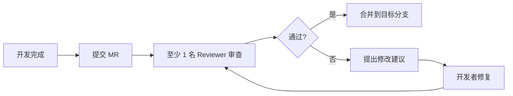

# 代码审查规范

代码审查（Code Review，简称 CR）是保障代码质量、传递团队知识、防止技术债堆积的关键环节。本规范适用于微信小程序原生开发场景。

## CR 流程



- **触发时机**：所有合并到 `main` / `develop` 分支的代码必须经过 CR
- **审查人数**：至少 1 名 Reviewer 通过，核心模块建议 2 名
- **审查时限**：Reviewer 应在 24 小时内给出首次反馈
- **合并方式**：推荐 **Squash Merge**，保持主分支提交历史清晰

## 审查检查清单

### 1. 架构与分层

- [ ] 是否遵循 [分层架构](../../getting-started/)？`pages` 不直接发请求、不操作 storage、不处理登录/支付流程，业务流程走 `services`
- [ ] 业务相关的 `wx.*`（`wx.request` / `wx.storage` / `wx.login` / `wx.requestPayment`）是否收口在 `services` 中？
- [ ] 是否存在反向依赖（如 `services` 引用 `pages`）？

### 2. 小程序特性

- [ ] `setData` 调用是否合并？避免高频、小批量调用导致渲染性能问题
  ```js
  // 反例：多次 setData
  this.setData({ a: 1 });
  this.setData({ b: 2 });

  // 正例：合并 setData
  this.setData({ a: 1, b: 2 });
  ```
- [ ] 是否在 `onUnload` / `onHide` 中清理了定时器、监听器？
- [ ] 分包是否合理？主包体积是否超过 2MB 限制？
- [ ] 是否使用了已废弃的 API？（参考[小程序废弃 API 列表](https://developers.weixin.qq.com/miniprogram/dev/framework/release/)）

### 3. 安全

- [ ] 敏感字段（手机号、身份证、密码）是否做了 [加密传输](../../features/encrypt/) 或脱敏？
- [ ] Token 是否存储在 `wx.setStorageSync`，而非明文拼接在 URL 中？
- [ ] 是否存在硬编码的 `AppID` / `AppSecret`？密钥应放在服务端
- [ ] 用户输入是否做了校验？小程序前端校验不能替代后端校验

### 4. 性能

- [ ] 长列表是否使用了虚拟滚动（如 `recycle-view`）？
- [ ] 图片是否启用了懒加载（`lazy-load`）？是否使用了合适的 CDN 尺寸参数？
- [ ] `wx.request` 是否设置了合理的 `timeout`？是否避免重复请求？
- [ ] 是否存在同步 API（`wx.getStorageSync` 等）在主线程频繁调用？

### 5. 可维护性

- [ ] 命名是否清晰？符合 [TypeScript 规则](https://typescript-eslint.io/rules/naming-convention)
- [ ] 是否有重复代码可以抽取到 `utils` 或 `services` 中？
- [ ] 是否添加了必要的[注释](../comments/)？
- [ ] 是否遵循 [RESTful API 规范](../restful/) 与后端交互？

### 6. 测试

- [ ] 纯函数（`utils`、`services` 中的业务逻辑）是否覆盖了单元测试？
- [ ] 是否覆盖了边界情况（空值、超长字符串、并发请求）？

## CR 原则

### 对事不对人

CR 的目标是改进代码，不是评判个人。建议使用"代码"而非"你"作为主语：

:::danger[反面例子 👎]
你这里写错了，怎么会用 `wx.setStorageSync` 而不是 `wx.setStorage`？
:::

:::tip[正面例子 👍]
这里使用同步存储会阻塞主线程，建议改为异步的 `wx.setStorage`。
:::

### 区分必须修改与建议修改

- **必须修改（Blocking）**：安全漏洞、Bug、架构违规、规范违反
- **建议修改（Non-blocking）**：命名优化、性能微调、可读性提升

必须修改的问题必须解决后才能合并；建议修改的问题可以记录为 TODO，后续迭代处理。

### 避免过度设计

不要在 CR 中要求开发者引入"未来可能用到"的抽象。遵循 [YAGNI](https://en.wikipedia.org/wiki/You_aren%27t_gonna_need_it) 原则，只在有明确需求时才抽象。

## 提交者自查清单

在提交 MR 前，开发者应先完成自查：

- [ ] 本地 `pnpm run lint` 通过
- [ ] 本地 `pnpm run test` 通过（如有相关测试）
- [ ] 在开发者工具中真机预览过，无控制台报错
- [ ] 已更新相关文档（如涉及 API 变更、目录结构调整）
- [ ] Commit message 遵循 [工作流程](../workflow/) 规范
