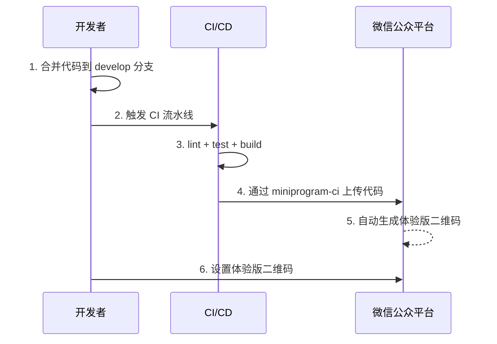
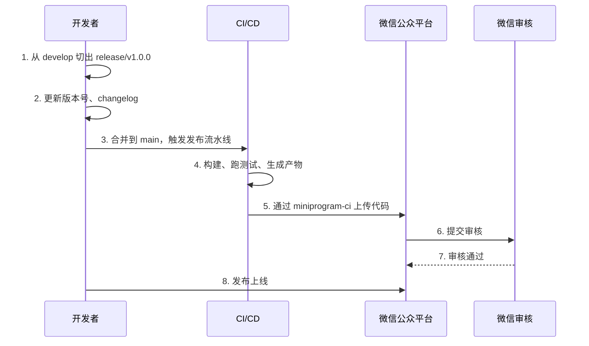

# 工作流程

分支策略、Commit 规范、代码审查流程与 Web 项目完全一致，此处不再重复。本文档仅说明小程序特有的发布与版本管理流程。

## 体验版发布



1. 在 `develop` 分支完成功能开发并合并
2. 触发 CI 自动构建并上传体验版（使用 `miniprogram-ci`）
3. 在微信公众平台设置体验版二维码

## 正式版发布



### 版本号管理

遵循 [SemVer](https://semver.org/lang/zh-CN/) 语义化版本：

- **主版本号（MAJOR）**：不兼容的 API 修改
- **次版本号（MINOR）**：向下兼容的功能新增
- **修订号（PATCH）**：向下兼容的问题修复

小程序版本号记录在 `project.config.json` 的 `setting.appVersion` 或 `package.json` 的 `version` 字段中。

### Changelog

每次发布应在仓库根目录维护 `CHANGELOG.md`，记录本次版本变更：

```markdown
## [1.0.0] - 2026-06-25

### Added
- 新增微信手机号一键登录
- 新增支付订单状态轮询

### Fixed
- 修复 iOS 下 wx.previewImage 闪退问题

### Changed
- 重构 http 拦截器，统一错误处理
```

## 体验版与正式版对比

| 版本 | 触发分支 | 用途 | 上传后操作 |
|------|---------|------|----------|
| 体验版 | `develop` | 内部测试 | 自动生成体验版二维码 |
| 正式版 | `main` | 用户发布 | 需在微信后台提交审核 |

:::tip
正式版上传后不会自动发布，需在微信公众平台 → 版本管理 → 提交审核，审核通过后手动发布。
:::

## 本地开发工作流

```bash
# 1. 克隆仓库
git clone <repo-url>
cd miniprogram

# 2. 安装依赖
npm install

# 3. 启用 husky 钩子
npx husky install
```

### 钩子约束

通过 husky + lint-staged 在提交前自动执行：

- **pre-commit**：对暂存区文件运行 ESLint、stylelint
- **commit-msg**：校验 commit message 是否符合 Conventional Commits

:::warning
如果钩子未生效，请运行 `npx husky install` 重新初始化。
:::
